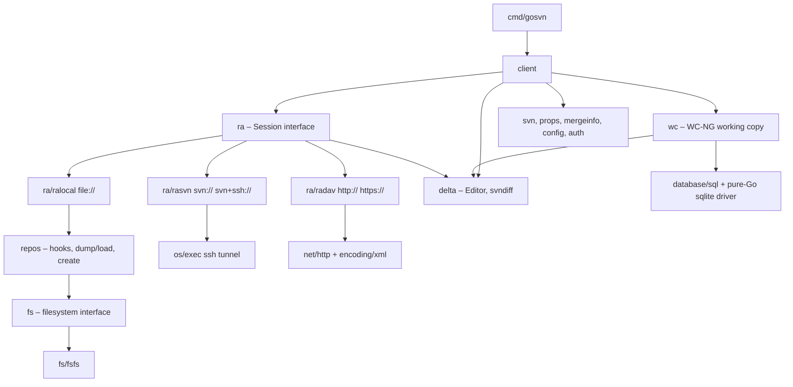

# go-svn — Design Specification

A pure-Go (`CGO_ENABLED=0`) Subversion client library that is wire- and
on-disk-compatible with the Apache Subversion reference implementation
(1.7 servers or newer, 1.8+ working copies), supporting `file://`, `svn://`,
`svn+ssh://`, `http://` and `https://` repositories.

The companion document [IMPLEMENTATION_PLAN.md](IMPLEMENTATION_PLAN.md)
breaks this design into small, independently testable phases intended to be
implemented by LLM agents.

---

## 1. Goals and non-goals

### 1.1 Goals

| # | Goal |
|---|------|
| G1 | Full **client** functionality of `svn` (checkout, update, switch, commit, status, diff, log, blame, merge, lock, props, externals, URL→URL operations, import/export) as a Go library plus a thin CLI for dogfooding. |
| G2 | **Three repository-access (RA) layers** mirroring the reference implementation: `ra_local` (`file://`, direct FSFS access), `ra_svn` (`svn://`, `svn+ssh://`), `ra_dav` (`http://`, `https://`, WebDAV/DeltaV "HTTPv2"). |
| G3 | **Interoperability**: repositories written by go-svn pass `svnadmin verify`; working copies created by go-svn are accepted unchanged by the reference `svn` CLI (format 31), and vice versa. |
| G4 | **Pure Go**: builds and passes all tests with `CGO_ENABLED=0` on linux/darwin/windows (amd64/arm64). |
| G5 | **Standard library first**: `net/http`, `encoding/xml`, `compress/zlib`, `crypto/*`, `net`, `os/exec`, `database/sql`, `net/url`, `bufio`, `io`. Third‑party code only where the stdlib has no equivalent (see §9). |
| G6 | **Streaming and cancellation**: every operation takes `context.Context`; large data flows through `io.Reader`/`io.Writer` and delta windows, never whole-file buffers. |
| G7 | **LLM-implementable**: small packages with sharp boundaries, exhaustive golden/fixture tests, and reference pointers into the Subversion source tree for every format/protocol. |

### 1.2 Non-goals (initially)

* Server implementations (`svnserve`, `mod_dav_svn`) — except the minimal in-process fakes used for tests.
* Berkeley DB (`fs_base`) and FSX repository back-ends. Only FSFS.
* Subversion HTTPv1 commits (the pre‑1.7 WebDAV/DeltaV `MKACTIVITY`/`CHECKOUT` workflow). Shared read operations remain supported against HTTPv1 servers; HTTP commits require the server to advertise HTTPv2 transaction resources. See §1.4.
* NTLM/Negotiate (Kerberos) HTTP auth, SASL mechanisms other than `ANONYMOUS`, `EXTERNAL`, `CRAM-MD5`, `PLAIN`.
* GUI/IDE integration, `svn patch` (stretch), `svnsync`/`svnrdump` (they fall out of `Replay` but are not required).
* WC formats < 31 (`svn upgrade` of 1.6 working copies).

### 1.3 Repository back-end choice: BDB vs FSFS vs FSX

The repository back-end is a server-side and `file://` concern. A remote
client sees the same RA API and wire protocols whether `svnserve` or
`mod_dav_svn` stores the repository in Berkeley DB, FSFS or FSX. Therefore,
not implementing BDB or FSX does **not** prevent go-svn from using those
repositories through `svn://`, `svn+ssh://`, `http://` or `https://`; it only
prevents direct `file://` access to them and prevents go-svn from creating or
administering them locally.

| Back-end | Advantages | Disadvantages | Pure-Go implementation impact | Decision |
|----------|------------|---------------|-------------------------------|----------|
| **Berkeley DB / BDB** (`fs_base`, `db/fs-type = bdb`) | Mature transactional database semantics; atomic multi-record updates, built-in locking and recovery; historically performed well for repositories with many small revisions. | Legacy back-end; operationally sensitive to Berkeley DB version, process permissions and unclean shutdown; requires log archival/recovery procedures; unsuitable for network filesystems; database environments can become wedged and require `svnadmin recover`; repositories are less transparent and harder to repair with ordinary filesystem tools; portability depends on the exact Berkeley DB library ABI. | Apache Subversion accesses it through the native Berkeley DB C library. Matching its database file formats, locking, logs and recovery in pure Go would amount to implementing Berkeley DB, while binding `libdb` would require CGO and platform-native packages. The cost is very high for little modern deployment value. | **Out of scope.** Supported remotely through the standard RA protocols. For direct access, require migration with `svnadmin dump/load` or `svnrdump`. |
| **FSFS** (`fs_fs`, `db/fs-type = fsfs`) | Default, widely deployed Subversion back-end; repository data is ordinary files; no external database runtime; robust under normal crash recovery via atomic file operations; straightforward backup and inspection; supports packing, representation sharing, logical addressing, packed revprops, zlib/LZ4, and all required repository semantics; best compatibility across Subversion releases and hosting products. | Writes serialize on a repository write lock; very large repositories require correct sharding/packing and cache tuning; format generations 1–8 significantly expand the parser/writer surface; packed data and L2P/P2L indexes are complex; direct access requires local-filesystem locking semantics and is not safe on arbitrary network filesystems. | Maps well to `os`, `io`, `bufio`, `compress/zlib`, `crypto/*` and a small internal LZ4 codec. The optional representation cache uses SQLite, but correctness does not depend on it. It is substantial work, yet it has no mandatory native dependency and can be tested against `svnadmin verify`. | **Implement first and fully.** Read formats 1–8; write formats 6–8; create format 8 by default. This is the only initial `file://` back-end. |
| **FSX** (`fs_x`, `db/fs-type = fsx`) | Derived from FSFS ideas with a redesigned on-disk layout aimed at better scalability, simpler/faster access patterns and future format evolution; avoids Berkeley DB; potentially attractive for very large repositories and future Subversion development. | Experimental in the targeted reference-implementation generations; not the default; much smaller installed base and ecosystem coverage; on-disk compatibility and administrative tooling guarantees are weaker than FSFS; fewer real-world fixtures and interoperability oracles; migration still uses dump/load rather than copying repository files. It is not merely another FSFS format: it is a separate back-end and must not be parsed by `fs/fsfs`. | Pure Go is feasible because it is file-based, but it requires a separate `fs/fsx` package, format parsers/writers, caches, transaction logic, packing and corruption tests. Reusing high-level `fs`, `repos`, delta and RA abstractions is appropriate; reusing FSFS on-disk code is not. | **Defer.** Reassess after FSFS, all RA layers and WC interoperability are complete, and only target an FSX format explicitly documented as stable by the chosen Subversion baseline. |

**Selection rationale:** FSFS is the only choice that simultaneously satisfies
pure-Go operation, broad real-world interoperability, stable reference
formats, local `file://` access and a practical validation path. BDB support
would violate the no-C-runtime goal or require rebuilding an unrelated
database engine. FSX could fit the pure-Go goal later, but its experimental
status and separate format would add large risk before the common client
surface is complete.

The `fs.FS` interface remains back-end-neutral. Repository opening reads
`db/fs-type` and dispatches through a registry; the initial registry contains
only `fsfs`. Encountering `bdb` or `fsx` returns a typed
`svn.ErrFSUnknownFSType` error that explains that remote access remains
available and suggests dump/load migration. A future `fs/fsx` implementation
can therefore be added without changing `repos`, `ra/ralocal` or `client`.

### 1.4 Commit protocol scope

In this document, **Subversion HTTPv1** and **Subversion HTTPv2** name two
generations of Subversion's WebDAV repository protocol. They do **not** mean
HTTP/1.0, HTTP/1.1 or HTTP/2 transport. The in-scope HTTPv2 commit workflow
can travel over HTTP/1.1 or HTTP/2 as negotiated by Go's `net/http` package.

| Repository URL | Commit protocol | Scope | How a commit is performed |
|----------------|-----------------|-------|---------------------------|
| `file://` | Local `repos` / `fs.FS` transaction | **In scope** | Open an FSFS transaction, apply the `delta.Editor` operations, run repository hooks, atomically finalize the new revision and update the working copy. |
| `svn://` | ra_svn `commit` command + editor protocol | **In scope** | Send the `commit` command, drive the pipelined ra_svn editor (`add-file`, `apply-textdelta`, property changes, deletes and copies), then `close-edit`; `svnserve` owns the repository transaction. |
| `svn+ssh://` | ra_svn over an SSH tunnel | **In scope** | Identical to `svn://` after the tunnel starts; SSH changes transport and authentication, not commit semantics. |
| `http://`, `https://` with `SVN-Me-Resource` | Subversion HTTPv2 transaction protocol (Subversion 1.7+) | **In scope** | `POST` `( create-txn )` or `( create-txn-with-props … )`; apply edits with `MKCOL`, `PUT`, `PROPPATCH`, `DELETE` and `COPY` against `SVN-Txn-Root-Stub`; finalize with `MERGE`; abort by deleting the transaction resource. |
| `http://`, `https://` without `SVN-Me-Resource` | Subversion HTTPv1 activity/working-resource protocol | **Read-only in scope; commits out of scope** | A reference client discovers an activity collection, creates an activity with `MKACTIVITY`, performs `CHECKOUT` to obtain mutable working-resource URLs, applies edits to those resources, and `MERGE`s the activity. It must delete or otherwise clean up the activity on failure. go-svn does not implement this state machine initially. |

HTTP capability detection happens during the initial `OPTIONS` exchange.
`SVN-Me-Resource` together with the transaction and revision stub headers
selects HTTPv2. If those headers are absent, `ra/radav` may use the legacy VCC
and baseline-collection discovery needed by shared read operations, but
`GetCommitEditor` fails immediately, before sending `MKACTIVITY`, `CHECKOUT`
or any mutating request, with a typed error wrapping
`svn.ErrUnsupportedFeature`. The message identifies the server as lacking
Subversion HTTPv2 commit support and recommends upgrading the server or using
`svn://`, `svn+ssh://` or `file://` where available.

This boundary applies to creating repository revisions through
`GetCommitEditor`. Independent DAV operations such as `LOCK`, `UNLOCK` and
revision-property `PROPPATCH` remain in scope when the server advertises and
authorizes them; they do not require the HTTPv1 activity-based commit engine.

HTTPv1 commits are deferred because:

1. The stated server baseline is Subversion 1.7 or newer, where HTTPv2 is
    advertised by `mod_dav_svn` and is the reference client's preferred path.
2. HTTPv1 is not a small fallback. Its activity, version-controlled resource,
    checked-in version and per-resource working-URL lifecycle forms a second
    commit engine with different discovery, request ordering, cleanup and
    error-recovery rules.
3. Supporting it would duplicate the highest-risk part of `ra_dav`: copy and
    delete ancestry checks, lock-token propagation, property changes,
    out-of-date errors, abort cleanup and ambiguous network-failure handling.
4. It adds compatibility primarily for pre-1.7 servers, while contributing
    nothing to pure-Go portability, current-server interoperability or support
    for HTTP/1.1 versus HTTP/2 transport.
5. Keeping the first release to one HTTP commit state machine allows the same
    cross-RA commit scenarios to validate HTTPv2 deeply rather than validating
    two paths shallowly.

The HTTP commit implementation uses a private strategy boundary
(`commitProtocol`) selected from `ServerInfo`. A later `httpv1Commit`
implementation can therefore be added without changing `ra.Session`, the WC
commit harvester or the public client API. Adding it requires transcript
fixtures from a Subversion 1.6 `mod_dav_svn`, failure-injection tests for every
activity lifecycle stage, and the full cross-RA commit conformance suite.

---

## 2. Reference implementation map

Implementers must consult these files in the Subversion source tree
(`https://svn.apache.org/repos/asf/subversion/trunk/`). Reading the *format
documents* is mandatory; reading the C code is optional but recommended when
the doc is ambiguous. go-svn is a re‑implementation under the Apache‑2.0
licence; retain NOTICE attribution where text is derived.

| Area | Reference document / source |
|------|-----------------------------|
| Error codes | `subversion/include/svn_error_codes.h` |
| Paths, URIs | `subversion/libsvn_subr/dirent_uri.c`, `svn_dirent_uri.h` |
| Hash file format (`K/V/END`) | `subversion/libsvn_subr/hash.c` |
| Skel format | `subversion/libsvn_subr/skel.c`, `subversion/include/private/svn_skel.h` (grammar in the header comment) |
| svndiff (0/1/2) | `notes/svndiff`, `subversion/libsvn_delta/svndiff.c`, `text_delta.c`, `xdelta.c` |
| Editor interface | `subversion/include/svn_delta.h` (`svn_delta_editor_t`), `libsvn_delta/path_driver.c`, `depth_filter_editor.c`, `cancel.c` |
| Properties, keywords, EOL | `subversion/libsvn_subr/subst.c`, `properties.c`, `svn_props.h` |
| Mergeinfo | `subversion/libsvn_subr/mergeinfo.c`, `svn_mergeinfo.h` |
| Config files | `subversion/libsvn_subr/config_file.c`, `config_impl.h`, `notes/…`; templates in `libsvn_subr/config_file.c` (default `config`/`servers`) |
| Auth cache | `subversion/libsvn_subr/auth.c`, `simple_providers.c`, `ssl_server_trust_providers.c`, `username_providers.c` |
| RA API | `subversion/include/svn_ra.h` |
| ra_svn protocol | **`subversion/libsvn_ra_svn/protocol`** (normative), `marshal.c`, `client.c`, `editorp.c`, `cram.c`, `svnserve/serve.c` |
| ra_dav (HTTP) | **`notes/http-and-webdav/webdav-protocol`**, `notes/http-and-webdav/http-protocol-v2`, `subversion/libsvn_ra_serf/*.c`, `subversion/mod_dav_svn/*.c` (server side is the best spec for REPORT bodies) |
| FS API | `subversion/include/svn_fs.h` |
| FSFS format | **`subversion/libsvn_fs_fs/structure`**, **`structure-indexes`**, `fs_fs.c`, `rev_file.c`, `cached_data.c`, `index.c`, `low_level.c`, `pack.c`, `revprops.c`, `lock.c`, `transaction.c`, `tree.c`, `id.c` |
| Repos layer, hooks | `subversion/libsvn_repos/hooks.c`, `repos.c`, `commit.c`, `load-fs-vtable.c`, `dump.c`, `notes/dump-load-format.txt`, `authz.c` |
| Working copy (WC‑NG) | **`subversion/libsvn_wc/wc-metadata.sql`**, `wc-queries.sql`, `wc_db.h`, `wc.h` (format numbers), `workqueue.c`, `conflicts.c`, `props.c`, `notes/wc-ng/*` |
| Client ops | `subversion/include/svn_client.h`, `libsvn_client/*.c` (notably `merge.c`, `update.c`, `commit.c`, `externals.c`, `blame.c`, `diff.c`) |
| CLI semantics | `subversion/svn/*.c`, `subversion/tests/cmdline/*.py` (reusable as behaviour oracles) |

---

## 3. Architecture



Layering rule: a package may import only packages **below** it in the table
in §4. `ra` never imports `wc`; `fs` never imports `ra`; `delta`, `svn`,
`props`, `mergeinfo` import nothing from the project except `svn`.

Every layer is an interface (`ra.Session`, `fs.FS`, `wc.DB`, `delta.Editor`)
with at least one in-memory or fake implementation used for tests.

---

## 4. Repository layout

Module path placeholder: `github.com/OWNER/go-svn` (replace on bootstrap).

```
go-svn/
├── go.mod                      # go 1.26+; see §9 for allowed deps
├── DESIGN.md
├── IMPLEMENTATION_PLAN.md
├── LICENSE                     # Apache-2.0
├── NOTICE
├── Makefile                    # test, lint, integration, fixtures targets
├── .github/workflows/ci.yml    # CGO_ENABLED=0 matrix, race, integration job
│
├── svn/                        # L0 core types, no deps
│   ├── revision.go             # Revnum, Revision (number|HEAD|BASE|COMMITTED|PREV|WORKING|date)
│   ├── kind.go                 # NodeKind, Depth, tristate
│   ├── props.go                # Props map[string][]byte, reserved names (svn:*), is-svn-prop helpers
│   ├── dirent.go               # Dirent, DirentFields
│   ├── log.go                  # LogEntry, ChangedPath, LogChangeAction
│   ├── lock.go                 # Lock
│   ├── checksum.go             # Checksum{Kind, Digest}, parse/format, MD5/SHA1 (crypto/md5, crypto/sha1)
│   ├── time.go                 # SVN date format 2006-01-02T15:04:05.000000Z, ParseDate/FormatDate, human formats
│   ├── errors.go               # Error{Code, Msg, Child}, Code constants generated from svn_error_codes.h
│   ├── errors_codes.go         # GENERATED table (name, number, message)
│   ├── path/                   # dirent / relpath / fspath / uri canonicalisation (mirror svn_dirent_uri.h)
│   ├── hashfile/               # "K n\n..V n\n..END\n" reader/writer (+incremental "D n" form)
│   ├── skel/                   # skel parser/serialiser (atoms, lists, implicit-length atoms)
│   └── notify/                 # Notify{Action, Path, Kind, ...} callback type mirroring svn_wc_notify_t
│
├── delta/                      # L1
│   ├── editor.go               # Editor / DirEditor / FileEditor / WindowHandler interfaces
│   ├── window.go               # Window, Op, OpKind, ApplyWindow (target reconstruction)
│   ├── svndiff_read.go         # svndiff0/1/2 decoder → Window stream
│   ├── svndiff_write.go        # encoder (v0/v1 always; v2 optional)
│   ├── varint.go               # 7-bit big-endian varint
│   ├── xdelta.go               # delta generator (source→target windows, 100 KiB target windows)
│   ├── txstream.go             # TxDeltaStream over two io.Readers; SendStream, SendString helpers
│   ├── apply.go                # ApplyTextDelta (window handler writing to io.Writer with MD5)
│   ├── pathdriver.go           # path_driver: drive Editor from a sorted list of paths
│   ├── depthfilter.go          # depth-filtering editor wrapper
│   ├── cancel.go               # context-checking editor wrapper
│   ├── debug.go                # tracing editor (for tests)
│   └── inmem.go                # in-memory tree editor: builds a tree snapshot (test oracle)
│
├── internal/lz4/               # minimal LZ4 block decode (+encode) for svndiff2 / FSFS f8 (§9)
├── mergeinfo/                  # L1 parse/serialise/set algebra, rangelist ops, inheritability
├── props/                      # L1 validation (svn:* canonical forms), keyword expansion, EOL translation, special (symlink) files, auto-props/ignores matching (path.Match w/ SVN glob rules)
├── config/                     # L1 INI reader/writer for ~/.subversion/{config,servers}, [groups] host matching, [tunnels], [auto-props], defaults embedded as text
├── auth/                       # L1 credential providers & on-disk cache (svn.simple, svn.username, svn.ssl.server), prompt callbacks, realm hashing (md5 of realm string)
│
├── ra/                         # L2 Session interface, Open(), scheme registry, capabilities, Reporter, CommitInfo
│   ├── ralocal/                # file:// – wraps repos+fs; runs hooks
│   ├── rasvn/                  # svn:// svn+ssh://
│   │   ├── marshal.go          # item tokenizer/writer (word, number, string, list), Tuple encode/decode with pattern strings
│   │   ├── conn.go             # framing, greeting, capability negotiation, auth exchange, command/response, auth-request handling
│   │   ├── sasl.go             # ANONYMOUS, EXTERNAL, CRAM-MD5 (crypto/hmac+md5), PLAIN
│   │   ├── tunnel.go           # svn+ssh via os/exec (config [tunnels], $SVN_SSH); Tunnel interface for x/crypto/ssh adapter
│   │   ├── editor_wire.go      # Editor ↔ wire commands both directions (drive remote editor; consume server editor commands)
│   │   ├── reporter.go         # set-path/link-path/delete-path/finish-report
│   │   └── session.go          # all RA commands
│   └── radav/                  # http(s)://
│       ├── transport.go        # http.Client construction: TLS (crypto/tls), proxies, timeouts, redirects, keep-alive
│       ├── authrt.go           # 401/407 challenge handling: Basic, Digest (RFC 7616, MD5/SHA-256), credential retry loop
│       ├── options.go          # OPTIONS discovery → ServerInfo (SVN-* headers, DAV capabilities)
│       ├── xmlns.go            # namespace constants
│       ├── propfind.go         # PROPFIND builder + streaming multistatus parser
│       ├── report_*.go         # update-report, log-report, get-locations, get-location-segments, dated-rev-report, file-revs-report, get-locks-report, replay-report, mergeinfo-report, inherited-props-report, list-report? (via PROPFIND depth 1)
│       ├── update_editor.go    # update-report XML → delta.Editor (send-all mode; skelta mode fetching via GET)
│       ├── commit.go           # HTTPv2 commit: POST create-txn, PUT/PROPPATCH/MKCOL/DELETE/COPY on !svn/txr, MERGE
│       ├── locks.go            # LOCK/UNLOCK, If: headers, lock tokens
│       └── session.go
│
├── fs/                         # L2 FS/Root/Txn interfaces (svn_fs.h subset)
│   └── fsfs/                   # FSFS formats 1–8 read; write for formats 6–8
│       ├── format.go           # db/format parsing (layout sharded N | linear, addressing logical|physical)
│       ├── fsfsconf.go         # fsfs.conf
│       ├── id.go               # node-revision IDs (node-id.copy-id.r<rev>/<item|offset>, txn ids)
│       ├── revfile.go          # locating rev data: sharded, packed (manifest for f4-6, footer+indexes f7+)
│       ├── index.go            # L2P / P2L indexes (little-endian 7-bit varints, pages, checksums)
│       ├── noderev.go          # node-revision header parser/writer
│       ├── rep.go              # representation headers (PLAIN / DELTA / DELTA r o l), ENDREP, delta chains, rep reading with zlib/lz4
│       ├── dircontents.go      # directory hash → entries
│       ├── changes.go          # changed-paths list read/write
│       ├── revprops.go         # revprops files, packed revprops (manifest, zlib), atomic write via rename
│       ├── locks.go            # db/locks digest files
│       ├── txn.go              # transactions dir, protorev files, next-ids, txn-current, node.* files
│       ├── commit.go           # finalize txn → rev, write-lock (fcntl), current update
│       ├── lockfile_unix.go    # fcntl(F_SETLKW) POSIX locks — must match APR for coexistence with svnserve
│       ├── lockfile_windows.go # LockFileEx via x/sys (optional) or best-effort
│       ├── repcache.go         # optional rep-cache.db (SQLite) read/write; disabled when driver absent
│       ├── create.go           # create new repository (format 8 by default)
│       └── verify.go           # verify (checksums, index consistency) – used in tests
│
├── repos/                      # L3 repository wrapper: hooks (os/exec), Open/Create, dump & load (svn dump format v3), authz (stretch), reporter/commit glue used by ralocal
│
├── wc/                         # L3 WC-NG (format 31, format 32 read-only stretch)
│   ├── db.go                   # DB interface + sqlite implementation over database/sql
│   ├── schema.go               # embedded wc-metadata.sql (format 31), STMT_* queries
│   ├── nodes.go                # NODES op_depth model, presence, BASE/WORKING views
│   ├── actual.go               # ACTUAL_NODE props, changelists, conflicts
│   ├── pristine.go             # pristine store (.svn/pristine/xx/<sha1>.svn-base)
│   ├── workqueue.go            # WORK_QUEUE skels: file-install, file-remove, sync-file-flags, prej-install, record-fileinfo, dir-remove, move, postupgrade
│   ├── lock.go                 # WC_LOCK, cleanup
│   ├── status.go               # status walker (text/prop mod detection with translated-size/last-mod-time shortcut)
│   ├── update_editor.go        # delta.Editor applying updates/switch to the WC (incl. conflicts, keywords, eol)
│   ├── commit.go               # harvest committables, drive commit editor, post-commit bump
│   ├── conflicts.go            # conflict skel storage, text/prop/tree conflicts, .mine/.rOLD/.rNEW, .prej
│   ├── externals.go            # svn:externals parsing (all 1.5+ syntaxes) and EXTERNALS table
│   ├── entries_compat.go       # write .svn/format and .svn/entries sentinel ("12")
│   └── crawl.go                # report working copy state to ra.Reporter
│
├── client/                     # L4 svn_client.h equivalents (one file per operation)
├── cmd/gosvn/                  # L5 CLI compatible with a useful subset of `svn`, incl. --xml output
│
├── internal/testutil/          # fixtures, temp repos, svnadmin/svnserve/httpd discovery, fake servers, transcript record/replay
└── testdata/                   # golden files, dumps, transcripts, svndiff vectors, fsfs sample repos (small, committed as tarballs or dumps)
```

---

## 5. Core abstractions (Go API sketch)

### 5.1 `svn` core types

```go
type Revnum int64
const InvalidRevnum Revnum = -1

type RevisionKind uint8 // Unspecified, Number, Date, Committed, Previous, Base, Working, Head
type Revision struct { Kind RevisionKind; Number Revnum; Date time.Time }

type NodeKind uint8 // None, File, Dir, Unknown, Symlink (WC only)
type Depth int8     // Unknown=-2, Exclude=-1, Empty=0, Files=1, Immediates=2, Infinity=3

type Props map[string][]byte // nil value never stored; absence == deleted

type Checksum struct { Kind ChecksumKind; Digest []byte } // MD5, SHA1, FNV1a32 (wc only)

type Error struct { Code Code; Message string; Cause error; File string; Line int }
func (e *Error) Error() string; Unwrap() error; Is(target error) bool // Is matches by Code
```

Error codes are the exact APR numbers (`120000 + category*5000 + n`) so that
`ra_svn`/`ra_dav` failures can be round-tripped verbatim and tests can assert
on `svn.ErrFSNotFound (160013)`, `svn.ErrRANotAuthorized (170001)`,
`svn.ErrFSTxnOutOfDate (160028)`, `svn.ErrWCLocked (155004)`, etc. The table is
generated by a `go:generate` script from `svn_error_codes.h`.

### 5.2 `delta.Editor`

A Go rendering of `svn_delta_editor_t`. Batons become interfaces; every method
takes a `context.Context`.

```go
type Editor interface {
    SetTargetRevision(ctx context.Context, rev svn.Revnum) error
    OpenRoot(ctx context.Context, baseRev svn.Revnum) (DirEditor, error)
    CloseEdit(ctx context.Context) error
    AbortEdit(ctx context.Context) error
}
type DirEditor interface {
    DeleteEntry(ctx context.Context, relpath string, rev svn.Revnum) error
    AddDirectory(ctx context.Context, relpath string, copyFrom *CopySource) (DirEditor, error)
    OpenDirectory(ctx context.Context, relpath string, baseRev svn.Revnum) (DirEditor, error)
    ChangeProp(ctx context.Context, name string, value []byte) error // value==nil deletes
    AbsentDirectory(ctx context.Context, relpath string) error
    AddFile(ctx context.Context, relpath string, copyFrom *CopySource) (FileEditor, error)
    OpenFile(ctx context.Context, relpath string, baseRev svn.Revnum) (FileEditor, error)
    AbsentFile(ctx context.Context, relpath string) error
    Close(ctx context.Context) error
}
type FileEditor interface {
    ApplyTextDelta(ctx context.Context, baseChecksum *svn.Checksum) (WindowHandler, error)
    ChangeProp(ctx context.Context, name string, value []byte) error
    Close(ctx context.Context, resultChecksum *svn.Checksum) error
}
type WindowHandler interface {
    Window(w *Window) error // called per window
    Close() error           // end of delta (equivalent to NULL window)
}
type CopySource struct { Path string; Rev svn.Revnum } // Path is a URL for RA, fspath for FS
```

Provided implementations: `Cancel(ctx, e)`, `DepthFilter(e, depth, target)`,
`Trace(w, e)`, `NewTreeBuilder()` (in-memory oracle), `Compose` (for commit
of props+text) and `PathDriver`.

### 5.3 `delta` text deltas

```go
type Window struct {
    SourceOffset, SourceLen, TargetLen int64
    Ops     []Op      // Kind: OpSource | OpTarget | OpNew; Offset, Len
    NewData []byte
}
func NewSvndiffReader(r io.Reader) (WindowReader, error)           // detects version 0/1/2
func NewSvndiffWriter(w io.Writer, version int, compression int) WindowHandler
func Apply(source io.ReadSeeker /*may be nil*/, target io.Writer, md5 hash.Hash) WindowHandler
func NewTxDeltaStream(source, target io.Reader) WindowReader        // xdelta generator
```

Constraints: target window ≤ 100 KiB (`SVN_DELTA_WINDOW_SIZE`); svndiff1
compresses instructions and new-data with `compress/zlib` only when the
compressed form is shorter; svndiff2 uses LZ4 block format (decode always
supported; encode optional — writers may always emit svndiff1 since every
1.4+ peer accepts it).

### 5.4 `ra.Session`

```go
type Session interface {
    URL() string
    Reparent(ctx context.Context, url string) error
    RepositoryRoot(ctx context.Context) (string, error)
    UUID(ctx context.Context) (string, error)
    HasCapability(ctx context.Context, cap Capability) (bool, error)

    LatestRevision(ctx context.Context) (svn.Revnum, error)
    DatedRevision(ctx context.Context, t time.Time) (svn.Revnum, error)
    RevProps(ctx context.Context, rev svn.Revnum) (svn.Props, error)
    RevProp(ctx context.Context, rev svn.Revnum, name string) ([]byte, bool, error)
    ChangeRevProp(ctx context.Context, rev svn.Revnum, name string, oldValue, newValue []byte, atomic bool) error

    CheckPath(ctx context.Context, path string, rev svn.Revnum) (svn.NodeKind, error)
    Stat(ctx context.Context, path string, rev svn.Revnum) (*svn.Dirent, error)
    GetFile(ctx context.Context, path string, rev svn.Revnum, w io.Writer, wantProps bool) (svn.Revnum, svn.Props, error)
    GetDir(ctx context.Context, path string, rev svn.Revnum, fields svn.DirentFields) ([]svn.Dirent, svn.Revnum, svn.Props, error)
    List(ctx context.Context, path string, rev svn.Revnum, patterns []string, depth svn.Depth, fields svn.DirentFields, fn func(relpath string, d *svn.Dirent) error) error
    Log(ctx context.Context, opts LogOptions, fn func(*svn.LogEntry) error) error
    GetLocations(ctx context.Context, path string, pegRev svn.Revnum, revs []svn.Revnum) (map[svn.Revnum]string, error)
    GetLocationSegments(ctx context.Context, path string, pegRev, start, end svn.Revnum, fn func(LocationSegment) error) error
    GetFileRevs(ctx context.Context, path string, start, end svn.Revnum, includeMerged bool, fn FileRevHandler) error
    GetMergeinfo(ctx context.Context, paths []string, rev svn.Revnum, inherit mergeinfo.Inheritance, includeDescendants bool) (map[string]mergeinfo.Mergeinfo, error)
    GetInheritedProps(ctx context.Context, path string, rev svn.Revnum) ([]InheritedProps, error)
    GetDeletedRev(ctx context.Context, path string, pegRev, endRev svn.Revnum) (svn.Revnum, error)

    DoUpdate(ctx context.Context, revToUpdateTo svn.Revnum, target string, depth svn.Depth, sendCopyFromArgs, ignoreAncestry bool, editor delta.Editor) (Reporter, error)
    DoSwitch(ctx context.Context, rev svn.Revnum, target string, depth svn.Depth, switchURL string, sendCopyFromArgs, ignoreAncestry bool, editor delta.Editor) (Reporter, error)
    DoStatus(ctx context.Context, target string, rev svn.Revnum, depth svn.Depth, editor delta.Editor) (Reporter, error)
    DoDiff(ctx context.Context, rev svn.Revnum, target string, depth svn.Depth, ignoreAncestry, textDeltas bool, versusURL string, editor delta.Editor) (Reporter, error)

    GetCommitEditor(ctx context.Context, revprops svn.Props, lockTokens map[string]string, keepLocks bool, done func(*CommitInfo) error) (delta.Editor, error)

    Lock(ctx context.Context, pathRevs map[string]svn.Revnum, comment string, steal bool, fn LockCallback) error
    Unlock(ctx context.Context, pathTokens map[string]string, breakLock bool, fn LockCallback) error
    GetLock(ctx context.Context, path string) (*svn.Lock, error)
    GetLocks(ctx context.Context, path string, depth svn.Depth) (map[string]*svn.Lock, error)

    Replay(ctx context.Context, rev, lowWaterMark svn.Revnum, sendDeltas bool, editor delta.Editor) error
    ReplayRange(ctx context.Context, start, end, lowWaterMark svn.Revnum, sendDeltas bool, begin func(rev svn.Revnum, props svn.Props) (delta.Editor, error), end func(rev svn.Revnum, props svn.Props, e delta.Editor) error) error

    Close() error
}

type Reporter interface {
    SetPath(ctx context.Context, path string, rev svn.Revnum, depth svn.Depth, startEmpty bool, lockToken string) error
    LinkPath(ctx context.Context, path, url string, rev svn.Revnum, depth svn.Depth, startEmpty bool, lockToken string) error
    DeletePath(ctx context.Context, path string) error
    FinishReport(ctx context.Context) error
    AbortReport(ctx context.Context) error
}

type Callbacks struct {
    Auth     auth.Baton            // credential providers & prompts
    Config   *config.Config
    Progress func(sent, total int64)
    Notify   func(notify.Notify)
    Tunnel   rasvn.TunnelFunc      // optional override for svn+ssh
    HTTP     *http.Client          // optional override (tests)
    Logger   *slog.Logger
}
func Open(ctx context.Context, url string, cb *Callbacks) (Session, string /*corrected URL*/, error)
```

Semantics follow `svn_ra.h` exactly (path arguments are relative to the
session URL; `rev == InvalidRevnum` means HEAD where allowed).

### 5.5 `fs.FS`

```go
type FS interface {
    UUID() string
    Youngest(ctx context.Context) (svn.Revnum, error)
    RevisionRoot(ctx context.Context, rev svn.Revnum) (Root, error)
    RevisionProps(ctx context.Context, rev svn.Revnum) (svn.Props, error)
    ChangeRevisionProp(ctx context.Context, rev svn.Revnum, name string, old, new []byte, atomic bool) error
    BeginTxn(ctx context.Context, base svn.Revnum, flags TxnFlags) (Txn, error)
    OpenTxn(ctx context.Context, name string) (Txn, error)
    ListTxns(ctx context.Context) ([]string, error)
    Lock/Unlock/GetLock/GetLocks/...
    Close() error
}
type Root interface {
    Revision() svn.Revnum; IsTxnRoot() bool
    CheckPath(ctx, path string) (svn.NodeKind, error)
    NodeProps(ctx, path string) (svn.Props, error)
    DirEntries(ctx, path string) (map[string]DirEntry, error)
    FileLength/FileChecksum/FileContents(ctx, path) (io.ReadCloser, error)
    PathsChanged(ctx) (map[string]Change, error)
    NodeID/NodeCreatedRev/NodeCreatedPath/ClosestCopy/NodeHistory/NodeOrigin
    GetFileDelta(ctx, srcRoot Root, srcPath, tgtPath string) (delta.WindowReader, error)
    Mergeinfo/…
}
type Txn interface {
    Name() string; BaseRevision() svn.Revnum
    Root(ctx) (TxnRoot, error)
    Props/ChangeProp
    Commit(ctx) (svn.Revnum, error) // returns ErrFSConflict / ErrFSTxnOutOfDate with conflict path
    Abort(ctx) error
}
type TxnRoot interface { Root; MakeDir; MakeFile; Delete; Copy(from Root, fromPath, toPath); ChangeNodeProp; ApplyTextDelta(path, base, result *svn.Checksum) (delta.WindowHandler, error); ApplyText(path, result *svn.Checksum) (io.WriteCloser, error) }
```

### 5.6 `wc.DB` and `client`

`wc` exposes an opaque `Context` (one per working copy root; holds the
`*sql.DB`, wcroot abspath, `WC_LOCK`s). Public operations correspond to
`svn_wc_*` functions used by `libsvn_client`. `client` exposes one function per
`svn` subcommand with an options struct, e.g.:

```go
func Checkout(ctx context.Context, c *Context, url string, peg, rev svn.Revision, dst string, o CheckoutOptions) (svn.Revnum, error)
func Update(ctx, c, paths []string, rev svn.Revision, o UpdateOptions) ([]svn.Revnum, error)
func Commit(ctx, c, targets []string, o CommitOptions) (*ra.CommitInfo, error)
func Status(ctx, c, path string, o StatusOptions, fn func(*Status) error) error
func Log(ctx, c, targets []string, peg svn.Revision, ranges []RevRange, o LogOptions, fn func(*svn.LogEntry) error) error
func Diff(ctx, c, DiffTarget, DiffTarget, o DiffOptions, out io.Writer) error   // unified diff, svn header format
func Blame(ctx, c, target, peg, start, end svn.Revision, o BlameOptions, fn BlameFunc) error
func Merge(ctx, c, src1, rev1, src2, rev2, target string, o MergeOptions) error // + MergePeg (automatic/cherry-pick), Reintegrate deprecated-but-supported
// Add, Delete, Copy, Move, Mkdir, Revert, Resolve, Cleanup, Export, Import, Info, List, Cat, PropGet/Set/Del/List, RevProp*, Lock, Unlock, Switch, Relocate, Upgrade(31 only), Changelist
```

---

## 6. Protocol and format requirements (normative summaries)

These summaries are what an implementer must get right; the referenced
documents in §2 are authoritative where they differ.

### 6.1 ra_svn (`svn://`, `svn+ssh://`)

* **Items**: `word` (`[A-Za-z][A-Za-z0-9-]*`), `number` (`\d+`), `string` (`<len>:<bytes>`), `list` (`( item… )`). Items are separated by single whitespace; a list closes with `) `. Implement a tokenizer over `bufio.Reader` and typed tuple readers/writers with pattern strings equivalent to `svn_ra_svn__parse_tuple` (`n`, `r`, `s`, `c`, `w`, `b`, `l`, `(`, `)`, `?`, `!`).
* **Handshake**: server → `( success ( 2 2 ( mech… ) ( cap… ) ) )`; client → `( 2 ( cap… ) url:string ra-client:string ( client:string ) )`; server → auth-request `( success ( ( mech… ) realm:string ) )`; client → `( mech:word ( token:string ) )`; server → `( step ( token ) ) | ( success ( [token] ) ) | ( failure ( msg ) )`; server → `( success ( uuid:string repos-url:string ( cap… ) ) )`.
* **Capabilities** the client advertises: `edit-pipeline`, `svndiff1`, `accepts-svndiff2`, `absent-entries`, `depth`, `mergeinfo`, `log-revprops`. Server capabilities to honour: `commit-revprops`, `atomic-revprops`, `partial-replay`, `inherited-props`, `ephemeral-txnprops`, `file-revs-reverse`, `list`, `svndiff2`.
* **Commands**: `( name:word ( params ) )`. **Every** command response is preceded by an auth-request (possibly with an empty mechanism list: `( success ( ( ) 0: ) )`) that the client must consume and, if non-empty, satisfy. Response: `( success ( … ) )` or `( failure ( ( apr-err:number msg:string file:string line:number ) … ) )` → converted into an `svn.Error` chain preserving numeric codes.
* **Editor over the wire** (`edit-pipeline`): client and server both drive `target-rev`, `open-root`, `delete-entry`, `add-dir`, `open-dir`, `change-dir-prop`, `close-dir`, `absent-dir`, `add-file`, `open-file`, `apply-textdelta`, `textdelta-chunk`, `textdelta-end`, `change-file-prop`, `close-file`, `absent-file`, `close-edit`, `abort-edit`, `finish-replay`. Tokens are client-generated strings (`d0`, `f1`, …). In pipelined mode, the driver sends all commands without reading responses and reads a single response at `close-edit`; errors may arrive early — implement the read-ahead check exactly as `editorp.c` (`check_for_error`).
* **Reports**: `set-path`, `delete-path`, `link-path`, `finish-report`, `abort-report`, then the server drives our editor.
* **Tunnels**: `svn+ssh://[user@]host[:port]/path` → run `$SVN_SSH` or config `[tunnels] ssh`, default `ssh -q --`, with `[-p port] [-l user] host svnserve -t`; stdin/stdout of the child are the connection (`os/exec`). Arbitrary `svn+<scheme>://` maps to `[tunnels] <scheme>`. An optional adapter package may implement the `Tunnel` interface with `golang.org/x/crypto/ssh` (not imported by default).
* **SASL**: only `ANONYMOUS`, `EXTERNAL` (tunnel identity), `CRAM-MD5` (`crypto/hmac` + `crypto/md5`, response `"<username> <hex-digest>"`), `PLAIN`. Reject `svnserve --sasl` servers offering only unsupported mechanisms with `ErrRANotAuthorized`.

### 6.2 ra_dav (`http://`, `https://`)

* Built entirely on `net/http` (`http.Client` with custom `RoundTripper`) and `encoding/xml` (`xml.Decoder` streaming; **never** unmarshal whole REPORT bodies into memory).
* **Discovery**: `OPTIONS <url>` with body `<D:options xmlns:D="DAV:"><D:activity-collection-set/></D:options>`; read headers `SVN-Youngest-Rev`, `SVN-Repository-UUID`, `SVN-Repository-Root`, `SVN-Me-Resource`, `SVN-Rev-Root-Stub`, `SVN-Rev-Stub`, `SVN-Txn-Root-Stub`, `SVN-Txn-Stub`, `SVN-VTxn-Root-Stub`, `SVN-VTxn-Stub`, `SVN-Allow-Bulk-Updates`, `SVN-Supported-Posts`, `SVN-Repository-MergeInfo`, and `DAV:` capability tokens (`http://subversion.tigris.org/xmlns/dav/svn/depth`, `…/mergeinfo`, `…/log-revprops`, `…/partial-replay`, `…/atomic-revprops`, `…/inherited-props`, `…/ephemeral-txnprops`, `…/inline-props`, `…/reverse-file-revs`, `…/list`). If `SVN-Me-Resource` is absent, the server is HTTPv1: reads continue via `!svn/vcc/default` + `!svn/bc/<rev>` discovery; commits fail with a clear error.
* **Namespaces**: `DAV:` (D), `svn:` (S, report bodies), `http://subversion.tigris.org/xmlns/dav/` (V), `http://subversion.tigris.org/xmlns/svn/` (svn: properties), `http://subversion.tigris.org/xmlns/custom/` (user properties). Property-name decoding must be exact (e.g. `S:log` in `svn/` ns ↔ `svn:log`; `D:creator-displayname` ↔ `svn:author`, `D:creationdate` ↔ `svn:date`, `D:comment` ↔ `svn:log` for live props).
* **Reads**: `PROPFIND` (depth 0/1) on `<rev-root-stub>/<rev>/<path>` for `Stat`/`GetDir`/props; `GET` for file contents (`Accept-Encoding: svndiff` + `SVN-Delta-Base` optional); `REPORT` on the rev-root or session URL for `update-report` (used for update/switch/status/diff), `log-report`, `get-locations`, `get-location-segments`, `dated-rev-report`, `file-revs-report`, `get-locks-report`, `replay-report`, `mergeinfo-report`, `inherited-props-report`, `get-deleted-rev-report`. `update-report` is requested with `send-all="true"` when `SVN-Allow-Bulk-Updates` permits (inline base64 `S:txdelta`), otherwise skelta mode (fetch each file via `GET` with `SVN-Delta-Base`).
* **Commits (HTTPv2)**: `POST <SVN-Me-Resource>` `Content-Type: application/vnd.svn-skel`, body `( create-txn )` or `( create-txn-with-props ( "svn:log" 5:hello … ) )`; response header `SVN-Txn-Name`. Then against `<SVN-Txn-Root-Stub>/<txn>/<path>`: `MKCOL`, `DELETE` (`X-SVN-Version-Name: <base rev>` for out-of-date detection), `COPY` (`Destination:`, `Overwrite: F`, source `<rev-root-stub>/<rev>/<path>`), `PUT` (`Content-Type: application/vnd.svn-svndiff`, `X-SVN-Base-Fulltext-MD5`, `X-SVN-Result-Fulltext-MD5`), `PROPPATCH` (`D:propertyupdate` / `D:set` / `D:remove`, `svn:` props in svn ns, others in custom ns, values base64 when non-XML-safe with `V:encoding="base64"`). Finalise with `MERGE <repo-root>` body `<D:merge><D:source><D:href><SVN-Txn-Stub>/<txn></D:href></D:source><D:no-auto-merge/><D:no-checkout/><D:prop><D:checked-in/><D:version-name/><D:resourcetype/><D:creationdate/><D:creator-displayname/></D:prop></D:merge>`; header `X-SVN-Options: release-locks` unless keepLocks; parse `D:merge-response` for new revision/date/author. Lock tokens are supplied via `If:` headers (`<url> (<token>)`) on the requests that touch locked paths, exactly as `ra_serf` does.
* **Locks**: `LOCK` with `D:lockinfo` (`D:lockscope/exclusive`, `D:locktype/write`, `D:owner`), `X-SVN-Options: lock-steal`, `X-SVN-Version-Name`; `UNLOCK` with `Lock-Token:` header, `X-SVN-Options: lock-break`.
* **Auth**: `Basic` and `Digest` (RFC 7616; MD5, MD5-sess, SHA-256; `qop=auth`; nonce-count tracking; `stale=true` retry). Challenge handling in a `RoundTripper` that replays request bodies (`GetBody`) and retries once per credential from `auth`. Proxies via `http.Transport.Proxy` from `servers` config (`http-proxy-host/port/username/password/exceptions`). TLS via `crypto/tls`: `ssl-authority-files`, `ssl-trust-default-ca`, unknown-CA prompt with failure bitmask compatible with `svn.ssl.server` cache (`ssl:unknown-ca`, `cn-mismatch`, `expired`, `not-yet-valid`, `other`), PEM client certs (`ssl-client-cert-file`; PKCS#12 optional stretch).
* Handle `301/302` redirects for the session URL (return corrected URL from `Open`), gzip via `Transport` default, `http-timeout`, `http-max-connections`, HTTP/2 automatically over TLS.

### 6.3 FSFS (`file://`)

* **Repository**: `<repo>/format` (=5), `README.txt`, `conf/`, `hooks/`, `locks/db.lock`, `locks/db-logs.lock`, `db/`. Refuse if `db/fs-type` ≠ `fsfs`.
* **`db/format`**: `<N>\nlayout sharded <size>|linear\n[addressing logical|physical]\n`. Support **read** N = 1…8, **write** N = 6, 7, 8 (default create: 8, sharded 1000, logical addressing, `compression = lz4` in `fsfs.conf` optional → write zlib when lz4 encoder not built).
* **Revision lookup**: `db/revs/<rev/shard>/<rev>` or packed `db/revs/<shard>.pack/pack` (+ `manifest` of offsets for N ≤ 6; N ≥ 7 appends L2P/P2L indexes and a footer `"<l2p-off> <l2p-md5> <p2l-off> <p2l-md5>"` followed by one byte footer length). `db/min-unpacked-rev` tells which shards are packed.
* **Physical addressing (N ≤ 6)**: rev file ends with `"<root-noderev-offset> <changes-offset>\n"`. IDs `node.copy.r<rev>/<offset>`.
* **Logical addressing (N ≥ 7)**: IDs `node.copy.r<rev>/<item>`; item 0 = changes list, item 1 = root node-rev. L2P: rev → item → offset; P2L: offset → items with types/checksums. Index varints are **little-endian 7-bit** (opposite of svndiff). Implement page caches keyed by (rev, page).
* **Node-revision** text records: `id:`, `type: file|dir`, `pred:`, `count:`, `text: <rev> <item|off> <size> <expanded> <md5> [<sha1> <uniquifier>]`, `props:`, `cpath:`, `copyroot: <rev> <path>`, `copyfrom: <rev> <path>`, `minfo-cnt:`, `minfo-here: y`, blank line terminator. Directory contents are hash-format `"<kind> <id>"` entries; prop reps are hash-format.
* **Representations**: header `PLAIN\n` | `DELTA\n` (delta against empty) | `DELTA <rev> <item|off> <len>\n`, body, `ENDREP\n`. Delta bodies are svndiff (0/1/2). Reconstruct via delta chain (walk `DELTA r o l` until `PLAIN`/`DELTA`), combining windows (`svn_txdelta_compose_windows` equivalent) or applying serially with buffering; correctness first, composition as optimisation. Verify MD5 (and SHA-1 when present) on read; expose `svn.Checksum`s for the WC pristine store.
* **Changed paths**: `<id> <action>[-<kind>] <text-mod> <prop-mod> [<mergeinfo-mod>] <path>\n<copyfrom-rev> <copyfrom-path>|\n`; actions `add|delete|modify|replace|reset`; kind suffix N ≥ 4; mergeinfo-mod N ≥ 7.
* **Revprops**: hash file `db/revprops/<shard>/<rev>` or packed `db/revprops/<shard>.pack/<start>.<n>` (zlib unless `compress-packed-revprops=false`; header lines count and sizes) with `manifest`. Writes: temp file + rename; packed revprop rewrite per `revprops.c`.
* **Transactions/commit**: `db/txn-current` (base-36 counter) under `db/txn-current-lock`; `db/transactions/<rev>-<txn>.txn/` with `props`, `next-ids`, `changes`, `node.<id>`, `node.<id>.props`, `node.<id>.children`, `itemidx` and `index.l2p`/`index.p2l` proto-index data (N ≥ 7); `db/txn-protorevs/<rev>-<txn>.rev` + `.rev-lock`. Commit: take `db/write-lock` (**POSIX `fcntl` lock**, same as APR — required to coexist with a running `svnserve`/`httpd` on the same repo), verify base revision & conflicts (`ErrFSConflict` w/ path, `ErrFSTxnOutOfDate`), write changes, indexes (N ≥ 7) and footer, rename protorev to `db/revs/…`, write revprops (`svn:date` UTC, `svn:author`, `svn:log`), update `db/current`, optional `rep-cache.db` insert (SHA‑1 → rep), remove txn dir. Maintain `db/node-origins/` (N ≥ 3) for `NodeOrigin`, and preserve `db/uuid` line 2 (instance id, N ≥ 7).
* **Locks**: `db/locks/<md5[0:3]>/<md5>` hash files (`path`, `token` (`opaquelocktoken:<uuid>`), `owner`, `comment`, `is-dav-comment`, `creation-date`, `expiration-date`) and parent digest files with `children`.
* **Hooks** (`repos`): `start-commit`, `pre-commit`, `post-commit`, `pre-revprop-change`, `post-revprop-change`, `pre-lock`, `post-lock`, `pre-unlock`, `post-unlock` via `os/exec`, with argv/stdin exactly as `hooks.c`, honouring `conf/hooks-env` (`[default]` + per-hook env). `pre-revprop-change` absence ⇒ refuse revprop changes, as the reference does.

### 6.4 Working copy (WC‑NG format 31)

* Layout: `<wcroot>/.svn/{format,entries,wc.db,pristine/,tmp/}`; `format` and `entries` both contain `12\n` (sentinel for old clients). `PRAGMA user_version = 31`. Pristines in `pristine/<sha1[0:2]>/<sha1>.svn-base`, uncompressed; `PRISTINE.checksum` stored as `$sha1$<hex>`.
* Schema and all statements are copied from `wc-metadata.sql` / `wc-queries.sql` (embedded as Go string constants; keep `STMT_*` names). Use `database/sql` with a pure-Go SQLite driver (§9). Journal mode DELETE (as reference) so a concurrent reference `svn` sees consistent state; always `BEGIN IMMEDIATE` around multi-statement mutations.
* NODES model: `op_depth` layering (0 = BASE, n = WORKING at depth n), `presence ∈ {normal, not-present, incomplete, base-deleted, excluded, server-excluded}`, `moved_to`/`moved_here`, `properties` and `inherited_props` as **skels**, `dav_cache` skel (may be NULL), `translated_size`/`last_mod_time` for the status fast-path.
* Work queue: every filesystem mutation is expressed as a `WORK_QUEUE` skel and executed by `wq.Run` so an interrupted operation is resumed by `cleanup` (`file-install`, `file-remove`, `sync-file-flags`, `prej-install`, `record-fileinfo`, `dir-remove`, `move`, `postupgrade`, `base-remove`? — match `workqueue.c`).
* Conflicts stored in `ACTUAL_NODE.conflict_data` skels per `conflicts.c` (`(conflict (why …) (text …) (prop …) (tree …))`), marker files `.mine`, `.r<OLD>`, `.r<NEW>`, `.prej`, `dir_conflicts.prej`.
* Text translation on install/commit: `svn:eol-style` (native/LF/CRLF/CR), `svn:keywords` (`Id Rev Revision Date LastChangedDate Author LastChangedBy URL HeadURL Header`, custom `%`-format keywords 1.8+), `svn:special` (symlink ↔ `link <target>` text), `svn:executable`, `svn:needs-lock` (read-only when unlocked), `svn:mime-type` binary detection.
* Externals: parse all forms of `svn:externals` (`-r N url dir`, `url@N dir`, `^/`, `//`, `/`, `../` relative, pegs), store in `EXTERNALS`, file externals; update/status/commit interplay per `externals.c`.
* Interop acceptance: after any go-svn operation, reference `svn status --xml -v`, `svn info --xml`, `svn cleanup`, `svn commit` must work on the same working copy with no complaints; the reverse holds for our client on reference-created WCs.

---

## 7. Cross-cutting requirements

| Topic | Requirement |
|-------|-------------|
| Go version | `go 1.26` minimum; CI also on latest stable. |
| CGO | `CGO_ENABLED=0 go build ./... && CGO_ENABLED=0 go test ./...` is the default CI job. No `import "C"` anywhere. |
| Context | All public functions take `context.Context` first; cancellation must abort network I/O (use `http.NewRequestWithContext`, `net.Dialer.DialContext`, `exec.CommandContext`) and long loops (check `ctx.Err()` per editor call via `delta.Cancel`). |
| Errors | `*svn.Error` with numeric code; wrap with `%w`; never `panic` on untrusted input (fuzzed decoders must return errors). |
| Streaming | No `io.ReadAll` on repository data; file contents and deltas stream through `io.Reader`/window handlers. Memory ceiling independent of file size. |
| Concurrency | Sessions are **not** goroutine-safe (as in the reference). `fs.FS` read roots are safe for concurrent use; writes serialize on the FSFS write-lock. WC `Context` is single-writer with `WC_LOCK` rows. |
| Time | UTC everywhere; `svn:date` format `2006-01-02T15:04:05.000000Z`. |
| Encoding | Paths are UTF-8; on darwin normalise NFD→NFC on read of directory listings as `svn` does (`--normalize` not needed). Windows: forward slashes internally, drive letters via `path` package. |
| Logging | `log/slog` via `Callbacks.Logger`; protocol tracing at `Debug` level including full ra_svn items and HTTP method/URL/status (never credentials). |
| Config | Honour `~/.subversion/config` & `servers` (or `--config-dir`), `SVN_SSH`, `SVN_EDITOR` (CLI only), `[miscellany] global-ignores`, `[auto-props]`, `[helpers]` ignored. |
| Portability | Symlink handling via `os.Readlink/Symlink`; executable bit via `os.Chmod` (no-op on Windows). File locking via `syscall.FcntlFlock` (unix) / `x/sys/windows.LockFileEx` (windows). |
| Security | Percent-decode and canonicalise URLs before use; reject `..` escapes from relpaths; verify TLS by default; never log secrets; hooks run without inheriting the environment unless `hooks-env` says so; XML decoder configured with `Strict = true`, entity expansion disabled by not setting `Entity`; limit list nesting depth in ra_svn marshaller (e.g. 64) and string lengths against a sane maximum (`64 MiB`) to prevent memory DoS from a hostile server. |
| Performance targets | Checkout throughput within 2× of reference `svn` over `svn://` on a 10k-file repo; FSFS read of a 100k-rev repo `log -l 1000` within 2×; svndiff apply ≥ 200 MiB/s. |

---

## 8. Test strategy

Every phase in the plan ships with tests from these categories. Test helpers
live in `internal/testutil`.

1. **Unit tests** (`go test ./...`, no external binaries): table-driven, golden files under `testdata/`. Each parser has an inverse (writer) and round-trip tests.
2. **Fuzz tests** (`go test -fuzz`, seed corpora committed): svndiff reader, ra_svn tokenizer/tuple parser, hash file, skel, FSFS node-rev/changes/index parsers, mergeinfo parser, config INI, WebDAV XML parsers, Digest challenge parser, externals parser.
3. **Fixture repositories**: `testdata/repos/*.dump` (dump format v3, small hand-made histories covering copies, moves, replaces, props, mergeinfo, binaries, symlinks, locks, packed shards, all FSFS formats). `testutil.Repo(t, dump)` loads via `repos.Load` (our code) and, when `svnadmin` exists, also via `svnadmin create/load`; tests assert byte-identical youngest rev trees and identical `svnadmin verify` success. Pre-built FSFS repos for formats 1–8 (created by reference tools of each era) are committed as tarballs for reader tests.
4. **Fake servers** (in-process, pure Go): `testutil/fakesvn` (speaks ra_svn against `fs`/in-memory tree) and `testutil/fakedav` (`net/http/httptest` mod_dav_svn subset). Used to unit-test the RA clients deterministically, including error injection (mid-stream disconnect, auth failures, `stale` digest nonces, 5xx).
5. **Transcript replay**: `testdata/transcripts/{rasvn,dav}/*.txt` recorded from real `svnserve`/`httpd` (via `testutil.Record`). Replayed through byte-exact fake servers so protocol compatibility is asserted in CI without svn binaries. Recording is refreshed by the integration job.
6. **Integration tests** (build tag `integration`; skipped when tools missing): discover `svnadmin`, `svn`, `svnserve`, `httpd`/`apache2` + `mod_dav_svn` (env overrides `GOSVN_SVNADMIN`, `GOSVN_HTTPD`, `GOSVN_DOCKER=1` to use `docker compose` in `testdata/docker/`). Harness starts `svnserve -d --listen-port 0 -r <root>` (with `passwd`, anonymous read / authenticated write, `--tunnel` mode via a stub tunnel script), and httpd with generated `httpd.conf` (Basic + Digest realms, `SVNAllowBulkUpdates On|Off|Prefer` variants, self-signed TLS). Runs the **conformance suite** (below) against `file://`, `svn://`, `svn+ssh://` (stub tunnel), `http://`, `https://`.
7. **Cross-RA conformance suite**: a single table of scenarios (`ra/conformance`) executed against every `ra.Session` implementation (including fakes): latest rev, revprops, check-path/stat for each kind, get-file with/without props, get-dir fields, log variants (limits, paths, changed paths, merged revs, revprops), locations/segments, file-revs, mergeinfo, update/switch/status/diff reports into `delta.TreeBuilder`, commit editor (add/mod/del/copy/move/prop/binary/large file > 1 MiB multi-window), locks, replay. Results must be identical across backends.
8. **Reference-CLI oracle tests** (`integration`): compare our outputs with `svn --xml` output for `log`, `info`, `list`, `status`, `blame`, `proplist`, and `svn diff` textual output; compare `svnadmin verify`, `svnadmin dump` bytes of repos committed to by go-svn vs by `svn`.
9. **WC interop tests** (`integration`): (a) go-svn checkout → `svn status/info/update/commit/cleanup` (reference) must succeed with expected output; (b) reference checkout → go-svn status/update/commit; (c) alternating operations; (d) `sqlite3`-free schema dump compared with reference (`SELECT … ORDER BY` snapshots of `NODES`, `ACTUAL_NODE`, `PRISTINE`).
10. **Hygiene**: `go vet`, `staticcheck`, `gofmt -l`, `-race` on unit tests, goroutine-leak checks in RA tests, `govulncheck`; `CGO_ENABLED=0 GOOS=windows go build ./...` cross-compile check.
11. **Benchmarks**: `delta` apply/generate, `fsfs` rev read, ra_svn marshal, checkout of a generated 10k-file repo.

---

## 9. Dependencies policy

Standard library first. The full allowed list of third‑party modules:

| Module | Used by | Why stdlib is insufficient | Isolation |
|--------|---------|----------------------------|-----------|
| `modernc.org/sqlite` (pure Go, via `database/sql`) | `wc`, `fs/fsfs` (rep-cache only) | WC‑NG and rep-cache are SQLite databases; stdlib has no SQLite. | Behind `wc.Driver` interface; `fsfs` rep-cache is optional (`fsfs.Options.RepCache`). RA-only users who don't import `wc` don't link SQLite. Alternative accepted: `github.com/ncruces/go-sqlite3` (wasm) — pick one, never both. |
| `golang.org/x/sys` | `fs/fsfs` (windows file locks), terminal password prompt in CLI | Windows `LockFileEx`; `termios` for no-echo prompt | build-tagged files only |
| `golang.org/x/crypto/ssh` | `ra/rasvn/sshtunnel` (**separate optional module**) | In-process SSH instead of spawning `ssh` | Not imported by default; default tunnel is `os/exec` like the reference |
| `golang.org/x/term` | `cmd/gosvn` | password prompt | CLI only |

Explicitly **not** used: any LZ4 module (implement `internal/lz4` block
decoder/encoder, ~200 lines, from the LZ4 block format spec), XML libraries
(`encoding/xml` suffices with careful namespace handling), HTTP clients,
SASL/GSSAPI libs, `testify` (use stdlib `testing` + small `internal/testutil`
assertions).

Any new dependency requires updating this table and a justification in the PR.

---

## 10. Compatibility matrix (targets)

| Peer | Versions | Notes |
|------|----------|-------|
| `svnserve` | 1.6 – 1.15 | protocol v2; capability-gated features |
| `mod_dav_svn` | 1.7 – 1.15 (HTTPv2), 1.5–1.6 read-only | Bulk & skelta update modes |
| FSFS read | formats 1–8 | including packed shards & packed revprops |
| FSFS write | formats 6, 7, 8 | `svnadmin verify` clean; readable by 1.8/1.9/1.10+ respectively |
| Working copy | format 31 (1.8–1.14) read/write; 32 (1.15) read-only stretch | `svn upgrade` from < 31 unsupported |
| Dump/load | format v2/v3 | `svnadmin dump` byte-compatible for repos we create |

---

## 11. Open decisions (record outcomes in this file)

1. SQLite driver: `modernc.org/sqlite` (default proposal) vs `ncruces/go-sqlite3`. Criteria: `CGO_ENABLED=0` on all targets, `database/sql` support, performance on `NODES` queries, binary size.
2. Whether `ra/radav` implements skelta (`send-all=false`) mode in the first release or requires `SVNAllowBulkUpdates On|Prefer`. Proposal: implement both; skelta is required for servers configured `Off`.
3. svndiff2 encoding: decode-only (proposal) unless benchmarks show a win.
4. Node-origins index (`db/node-origins`) maintenance on commit: implement (reference does when format ≥ 3) — required for `svnadmin verify`? (No, but `svn log -g`/`NodeOrigin` uses it.) Proposal: implement.
5. Format 32 working copies (`store-pristine=no`): read-only support after 31 is fully interoperable.
