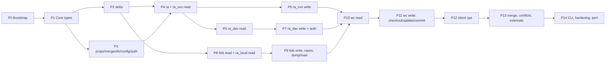

# go-svn — Phased Implementation Plan

Companion to [DESIGN.md](DESIGN.md). Each phase is split into **work items**
sized so that a single LLM agent session can complete one item end‑to‑end
(read references → write tests → implement → run `make check`). Items list
their inputs, deliverables, acceptance tests and explicit non-goals.

## 0. Working rules for implementing agents

1. **One work item per PR/branch.** Do not start the next item until
   `make check` is green (`CGO_ENABLED=0 go build ./... && go vet ./... && go test -race ./...`).
2. **Tests first.** Write the tests named in *Acceptance* before the code.
   Golden files go under `testdata/<package>/`; generate them with a
   `go:generate`-able script or from reference tools and commit them.
3. **Read the referenced Subversion documents** (DESIGN.md §2) before
   implementing a format/protocol item. When the doc and the C code differ,
   the C code wins; record the discrepancy in a comment with the file:line.
4. **Do not invent wire formats.** If a behaviour cannot be derived from the
   references or a recorded transcript, stop and add a `TODO(spec)` with the
   question rather than guessing.
5. **No new dependencies** outside DESIGN.md §9. No `import "C"`.
6. **Public API stability**: packages `svn`, `delta`, `ra`, `fs`, `wc`,
   `client` are public; everything else under `internal/` or unexported.
7. **Every parser gets a fuzz test** (`FuzzXxx`) with a committed seed corpus.
8. **Every RA feature is added to the conformance suite** (`ra/conformance`),
   never only to one backend's tests.
9. Keep files ≤ ~800 lines; keep functions ≤ ~100 lines; prefer table-driven
   tests.
10. Update DESIGN.md §11 when an open decision is resolved.

Phase dependency graph:

Phases 4–5, 6–7 and 8–9 are independent and can be implemented in parallel by
different agents once P2/P3 exist.

---

## Phase 0 — Bootstrap

**Goal**: an empty module that already enforces the project's constraints.

| Item | Deliverables | Acceptance |
|------|--------------|------------|
| 0.1 Module & CI | `go.mod` (go 1.23), `Makefile` (`check`, `test`, `fuzz`, `integration`, `fixtures`, `lint`), `.github/workflows/ci.yml` (matrix linux/darwin/windows × CGO_ENABLED=0; `-race` on linux; `staticcheck`; `govulncheck`; cross-compile windows/arm64), `LICENSE`, `NOTICE`. | CI green on empty module; `CGO_ENABLED=0` set in every job. |
| 0.2 testutil skeleton | `internal/testutil`: `TempDir`, `Golden(t, name, got)` with `-update` flag, `Must`, `FindTool(name, env)` (svnadmin/svn/svnserve/httpd discovery, returns skip reason), `SkipUnlessIntegration(t)`. | Unit tests for golden update flow. |
| 0.3 Fixture pipeline | `testdata/README.md` describing every fixture and how it is regenerated; `scripts/fixtures/*.sh` that (given svn tools) generate dumps, FSFS repos for formats 1–8 (using `svnadmin create --compatible-version`), and transcripts. Commit outputs. | `make fixtures` is idempotent; fixtures small (< 5 MiB total). |
| 0.4 Integration harness | `internal/testutil/servers`: `StartSvnserve(t, reposRoot, opts)` (random port, `svnserve.conf`, `passwd`), `StartHTTPD(t, ...)` (generated `httpd.conf` with `mod_dav_svn`, Basic + Digest realms, optional TLS with self-signed cert, `SVNAllowBulkUpdates` variants), `TunnelScript(t)` (shell script that execs `svnserve -t -r root`, used as `SVN_SSH`), `docker compose` fallback under `testdata/docker/`. | `go test -tags integration ./internal/testutil/servers` starts and stops each server; skips cleanly when tools missing. |

---

## Phase 1 — Core types (`svn`)

Refs: `svn_types.h`, `svn_error_codes.h`, `svn_dirent_uri.h`/`dirent_uri.c`, `hash.c`, `skel.c`, `svn_time.c`, `checksum.c`.

| Item | Deliverables | Acceptance |
|------|--------------|------------|
| 1.1 Basic types | `svn/revision.go`, `kind.go`, `props.go`, `dirent.go`, `log.go`, `lock.go`, `notify/`. `Revision` parse/format per `svn` CLI grammar (`HEAD`, `BASE`, `COMMITTED`, `PREV`, `{2024-01-01}`, `r123`, `123`, ranges `a:b`). Depth ↔ word conversions. | Table tests incl. every CLI revision spelling; `Depth.String()` round trips. |
| 1.2 Errors | `svn/errors.go`; `go:generate` script `svn/gen_errors.go` parsing `svn_error_codes.h` (vendored copy in `testdata/svn_error_codes.h`) into `errors_codes.go`: constant per code, `Code.String()`, default message. `errors.Is` matches by code; `Wrap`, `Trace` chain like `svn_error_trace`. | Generated table contains ≥ 300 codes; known values assert (`ErrFSNotFound==160013`, `ErrRANotAuthorized==170001`, `ErrWCLocked==155004`, `ErrFSTxnOutOfDate==160028`, `ErrRASvnUnknownCmd==210001`). |
| 1.3 Checksums & time | `checksum.go`: MD5/SHA1/FNV1a32, `Parse("$sha1$…")`, hex, empty-string digests constants; `time.go`: `ParseDate`/`FormatDate` (6-digit micros), `svn_time_from_cstring` legacy human formats accepted. | Golden vectors from `svn_time.c` tests; fuzz `ParseDate`. |
| 1.4 Paths | `svn/path`: `Dirent*`, `Relpath*`, `Fspath*`, `URI*` families: `Canonicalize`, `IsCanonical`, `Join`, `Dirname`, `Basename`, `Split`, `IsAncestor`, `SkipAncestor`, `GetLongest Ancestor`, `URIToDirent`/`DirentToFileURL`, `URIEncode/Decode`, `IsRootPath`, `IsURL`, `IsChild`, `Condense` (for targets). Windows drive/UNC handling. | Port the `dirent_uri-test.c` tables into Go golden tests (≥ 400 cases). Fuzz `URICanonicalize` for idempotency. |
| 1.5 Hash file format | `svn/hashfile`: `Read(r) (Props, error)`, `Write(w, Props)` (the reference writes in hash-iteration order; **we write sorted**; readers must accept any order), `ReadIncremental` with `D` records. | Round trip; fixtures from real FSFS revprops files; fuzz. |
| 1.6 Skel | `svn/skel`: parse/serialize atoms & lists, implicit vs explicit atom lengths per `skel.c` rules, `Proplist ↔ Props`, `IsValidProplist`. | Golden pairs from `skel-test.c`; fuzz. |

---

## Phase 2 — Deltas & Editor (`delta`, `internal/lz4`)

Refs: `notes/svndiff`, `svndiff.c`, `text_delta.c`, `xdelta.c`, `compose_delta.c`, `svn_delta.h`, `path_driver.c`, `depth_filter_editor.c`, `cancel.c`, `default_editor.c`; LZ4 block format spec.

| Item | Deliverables | Acceptance |
|------|--------------|------------|
| 2.1 Window model & apply | `window.go`, `apply.go`: `Window`, `Op`, `ApplyWindow(source []byte, w) ([]byte, error)`, streaming `Apply(sourceReadSeeker, targetWriter, md5)` handling overlapping target copies (`OpTarget` with offset+len > current length must replicate byte-by-byte). | Vectors from `text_delta-test`, `random-test` style property test: random source/target, generate with 2.3, apply, compare. |
| 2.2 svndiff0/1 codec | `varint.go`, `svndiff_read.go`, `svndiff_write.go`: header `SVN\0`/`SVN\1`, per-window compression decisions, zlib via `compress/zlib`, strict validation (op bounds, lengths, trailing bytes → error codes `ErrSvndiffInvalidHeader`, `ErrSvndiffCorruptWindow`, `ErrSvndiffUnexpectedEnd`, `ErrSvndiffInvalidOps`, `ErrSvndiffInvalidCompressedData`). | Golden svndiff files produced by `svnadmin dump --deltas` and `svn` traffic; round trip encode→decode; fuzz reader (no panics). |
| 2.3 xdelta generator | `xdelta.go`, `txstream.go`: `NewTxDeltaStream(source, target)` yielding ≤ 100 KiB target windows; rolling hash matching (`xdelta.c` algorithm, block 64) plus `vdelta`-free literal fallback; `SendStream`, `SendString`, `SendContents` helpers with MD5 of result. | Property test (2.1); compression ratio on `testdata/delta/*.{a,b}` within 20 % of reference svndiff sizes recorded in `sizes.txt`. |
| 2.4 LZ4 & svndiff2 | `internal/lz4`: block decode (mandatory), encode (greedy, optional but default on); `svndiff_read.go` handles `SVN\2` (LZ4 sections). | LZ4 vectors from the reference LZ4 test suite; svndiff2 goldens captured from a 1.10+ server (`svndiff2` cap); fuzz decoder. |
| 2.5 Editor interfaces & utilities | `editor.go`, `cancel.go`, `depthfilter.go`, `debug.go`, `pathdriver.go`, `inmem.go` (`TreeBuilder` records final tree: kind, props, content checksum, copyfrom). `Noop` editor; `Compose` for driving two editors. | `TreeBuilder` used to verify `PathDriver` orders opens/closes as `path_driver.c` (goldens of call traces); `DepthFilter` tests from `depth_filter_editor` semantics; `Cancel` aborts on ctx cancel. |
| 2.6 Window composition (optional perf) | `compose.go`: `ComposeWindows(a, b)` for delta chains. | Equivalence vs sequential apply on random chains. |

---

## Phase 3 — Properties, mergeinfo, config, auth

Refs: `subst.c`, `properties.c`, `mergeinfo.c`, `config_file.c`, `config_win.c` (ignored), `auth.c`, `simple_providers.c`, `username_providers.c`, `ssl_server_trust_providers.c`, `cmdline.c` (prompting), `svn_props.h`.

| Item | Deliverables | Acceptance |
|------|--------------|------------|
| 3.1 Property validation | `props/validate.go`: canonicalisation & validation for `svn:executable`, `svn:needs-lock`, `svn:special` (value `*`), `svn:mime-type`, `svn:eol-style`, `svn:keywords`, `svn:ignore`, `svn:global-ignores`, `svn:externals`, `svn:mergeinfo`, `svn:auto-props`, `svn:inheritable-*`, `svn:date`, `svn:log` (UTF-8 + LF normalisation), reject setting `svn:*` unknown on wrong kinds, binary detection (`svn_io_detect_mimetype2`). | Tables from `svn_prop_*` behaviour in `props-test.c` & `subst-test`. |
| 3.2 Keywords & EOL | `props/subst.go`: `Translate(r, w, eol, keywords, expand, repair)` streaming; keyword forms (`$Rev$`, `$Rev: 123 $`, `$Rev::      $` fixed-width), custom keyword `%`-formats (`%a %b %d %D %P %r %R %u %_ %%`), `svn:special` symlink ↔ `link target`, `DetranslateFile`. | Goldens from `subst-test`/`translate-test`; fuzz translator for idempotency of detranslate(translate(x)). |
| 3.3 Mergeinfo | `mergeinfo/`: `Parse`, `String`, `Rangelist` ops (`Merge`, `Diff`, `Intersect`, `Remove`, `Reverse`, `Inheritable`, `ToRevs`), `Mergeinfo` map ops, catalog ops, `Inheritance` enum. | Port `mergeinfo-test.c` tables (all `mergeinfo_paths` / `rangelist_*` cases); fuzz `Parse`. |
| 3.4 Config | `config/`: INI parser preserving comments & order for rewrite, `[groups]` wildcard host matching (`*.example.com`), typed getters with defaults, embedded default `config`/`servers` templates, `Load(configDir)` honouring `$HOME/.subversion`, `--config-option` overrides `FILE:SECTION:OPTION=VALUE`, `[tunnels]`, `[auto-props]`, `global-ignores` default list, `store-passwords`, `store-plaintext-passwords`, `http-*`, `ssl-*`. | Parse the shipped reference default templates; goldens of tricky INI (line continuations, `%(name)s` expansion, case-insensitive keys). |
| 3.5 Auth | `auth/`: `Baton` with provider chain, `Credentials` kinds (`simple`, `username`, `ssl-server-trust`, `ssl-client-cert`, `ssl-client-cert-pw`), `Prompt` callbacks, on-disk cache read/write compatible with `~/.subversion/auth/svn.simple/<md5(realm)>` (`svn:realmstring`, `username`, `password`, `passtype=simple`), `svn.username`, `svn.ssl.server` (`ascii_cert`, `failures`), refusal to read non-`simple` passtypes with a clear `Unavailable` result; `store-plaintext-passwords` prompt semantics; optional macOS keychain provider via `security` CLI (os/exec) behind build tag. | Fixture auth dir generated by reference `svn --username … --password …` against a fake server; we read the same creds; we write a file the reference client then reuses (integration). |

---

## Phase 4 — RA framework + ra_svn (read-only)

Refs: `svn_ra.h`, `ra_loader.c`, **`libsvn_ra_svn/protocol`**, `marshal.c`, `client.c`, `editorp.c`, `cram.c`, `svnserve/serve.c`, `svnserve/cyrus_auth.c` (mechanism names only).

| Item | Deliverables | Acceptance |
|------|--------------|------------|
| 4.1 `ra` package | `ra/session.go` (interface), `ra/open.go` (scheme registry, `Open`, corrected-URL redirects), `ra/capabilities.go`, `ra/log.go` (`LogOptions`), `ra/conformance/` runner with an in-memory reference implementation (`ra/inmem`) used to validate the suite itself. | Conformance suite passes on `ra/inmem`. |
| 4.2 ra_svn marshalling | `rasvn/marshal.go`: `Reader` (tokenizer with limits: max string 64 MiB, max depth 64), `Writer` (buffered, `Flush`), `Item` tree, `ParseTuple(items, pattern, &vals...)` / `WriteTuple(pattern, vals...)` covering all pattern chars incl. optional groups `?` and `!` prefix semantics of the reference. | Goldens of items from transcripts; fuzz `Reader`; property test write→read. |
| 4.3 Connection & auth | `rasvn/conn.go`, `sasl.go`, `tunnel.go`: TCP dial (`net.Dialer`, default port 3690, IPv6), greeting/version/capabilities, auth-request handling helper used by every command, mechanisms `ANONYMOUS`, `EXTERNAL`, `CRAM-MD5`, `PLAIN` (only over tunnel or if user forces), realm → `auth` lookup, failure → retry with next credential, `svn+ssh` tunnel via `os/exec` with `[tunnels]`/`$SVN_SSH`, `svn+<x>` generic tunnels, `TunnelFunc` injection. | Fake server tests: anonymous read, CRAM-MD5 success/failure (RFC 2195 vector), tunnel via a Go test binary acting as `svnserve -t` shim; goroutine-leak-free close; `ctx` cancel mid-handshake. |
| 4.4 Read commands | `rasvn/session.go`: `reparent`, `get-latest-rev`, `get-dated-rev`, `rev-proplist`, `rev-prop`, `get-file` (stream chunks, MD5 verify), `get-dir` (fields bitmask words), `list` (cap `list`), `check-path`, `stat`, `log` (all options; `log-revprops`; streamed entries; nested merged revisions with `has-children`), `get-locations`, `get-location-segments`, `get-file-revs` (incl. reverse), `get-mergeinfo`, `get-iprops`, `get-deleted-rev`, `get-lock`, `get-locks`. | Conformance suite against fake server; transcript replay tests for each command (recorded from svnserve 1.14). |
| 4.5 Server-driven editor & reports | `rasvn/editor_wire.go` (consume `target-rev … close-edit` and drive a `delta.Editor`; `textdelta-chunk` stream → svndiff reader; `absent-*`; `abort-edit`), `rasvn/reporter.go`; `update`, `switch`, `status`, `diff` commands; `replay`, `replay-range` (`revprops` and `finish-replay`). | Conformance: update into `TreeBuilder` equals `GetDir`/`GetFile` snapshot; replay of every rev of fixture repos reconstructs the trees; error injected mid-edit surfaces `svn.Error` and aborts editor. |
| 4.6 Integration (read) | `integration` tests against real `svnserve` (anonymous + password + tunnel shim). | Conformance suite passes; transcripts re-recorded and diffed (`make transcripts`). |

---

## Phase 5 — ra_svn write operations

| Item | Deliverables | Acceptance |
|------|--------------|------------|
| 5.1 Commit editor | `rasvn/editor_wire.go` (driver side: tokens, pipelining, early error detection, `textdelta-chunk` from svndiff writer choosing svndiff1/2 by caps, `close-edit` → `CommitInfo` (`( new-rev:number date:string author:string ? post-commit-err:string )`), `commit` command with `revprops` (cap `commit-revprops`), lock tokens, `keep-locks`; `ephemeral-txnprops` client caps (`svn:txn-client-compat-version`, `svn:txn-user-agent`). | Conformance commit scenarios against fake server (add/mod/del/copy/move/replace/props/large binary); integration: commit via go-svn, verify with `svn log -v --xml` and `svnadmin verify`; server-side `pre-commit` hook rejection surfaces `ErrReposHookFailure` with hook stderr. |
| 5.2 Locks & revprops | `lock-many`/`unlock-many` with fallback to `lock`/`unlock` for old servers; `change-rev-prop` (+ `atomic-revprops`, `dont-care` semantics). | Conformance + integration with `pre-revprop-change` hook. |

---

## Phase 6 — ra_dav (read-only)

Refs: `notes/http-and-webdav/*`, `libsvn_ra_serf/{options,propfind,get_file,getdir,log,update,getlocations,getlocationsegments,get_deleted_rev,getlocks,mergeinfo,inherited_props,replay,blame,serf.c,util.c,xml.c}`, `mod_dav_svn/{reports/*.c,liveprops.c,version.c,repos.c}`.

| Item | Deliverables | Acceptance |
|------|--------------|------------|
| 6.1 Transport | `radav/transport.go`: `http.Client` built from `config`+`servers` (proxy, timeouts, max conns, `ssl-*`, `crypto/tls` config, unknown-CA prompt with `svn.ssl.server` cache), `User-Agent: SVN/<ver> (go-svn)`, redirect policy returning corrected URL, request body replay support (`GetBody`), context propagation, response draining. | httptest tests for redirects, proxy env, TLS trust prompt, timeouts, cancellation. |
| 6.2 XML utilities | `radav/xmlns.go`, `radav/xmlstream.go`: `xml.Decoder`-based streaming state machine helper (element path matching with namespaces, cdata accumulation, base64 sinks), multistatus parser, error body parser (`D:error` / `S:human-readable errcode=`) → `svn.Error` with numeric code; HTTP status → error mapping (401/403 → `ErrRANotAuthorized`, 404 → `ErrFSNotFound` / `ErrRADavPathNotFound`, 5xx → `ErrRADavRequestFailed`). | Goldens of real response bodies; fuzz the stream helper. |
| 6.3 OPTIONS & PROPFIND | `options.go` (`ServerInfo`, capability parsing, explicit `CommitProtocol` selection: HTTPv2 only when `SVN-Me-Resource` and required transaction stubs are advertised; HTTPv1 fallback discovery of `!svn/vcc/default` and baseline-collection for reads), `propfind.go` (`PROPFIND` depth 0/1 with property lists; live prop decode; `D:resourcetype`, `D:version-name`, `D:creationdate`, `D:creator-displayname`, `D:getcontentlength`, `V:md5-checksum`, `V:repository-uuid`, `V:baseline-relative-path`, `V:deadprop-count`, `D:lockdiscovery`). Implements `RepositoryRoot`, `UUID`, `LatestRevision`, `CheckPath`, `Stat`, `GetDir`, `RevProps`, `RevProp`. | Fake DAV server tests + integration; `GetDir` fields match `svn ls -v --xml`; OPTIONS fixtures cover complete HTTPv2 headers, legacy HTTPv1 discovery, and incomplete/malformed HTTPv2 advertisements. |
| 6.4 GET & svndiff | `get_file.go`: `GET <rev-root>/<path>` streaming with MD5 verify; `SVN-Delta-Base` + `Accept-Encoding: svndiff` path used by skelta mode. | Conformance `GetFile`; large file > 10 MiB streamed with bounded memory (test measures allocations). |
| 6.5 REPORTs | `report_log.go` (log-report incl. `S:limit`, `S:revprop`, `S:all-revprops`, `S:include-merged-revisions`, `S:encode-binary-props`, changed paths attrs), `report_locations.go`, `report_location_segments.go`, `report_dated_rev.go`, `report_file_revs.go` (base64 txdelta chunks → `delta` windows; `S:merged-revision`), `report_locks.go`, `report_mergeinfo.go`, `report_iprops.go`, `report_deleted_rev.go`. | Conformance suite; goldens of REPORT request bodies compared byte-exactly (canonical XML formatting) with bodies recorded from `svn` 1.14 (ra_serf) to keep servers happy. |
| 6.6 update-report | `update_editor.go`: request builder (`S:update-report`, `send-all`, `S:src-path`, `S:dst-path`, `S:target-revision`, `S:update-target`, `S:depth`, `S:recursive`, `S:ignore-ancestry`, `S:send-copyfrom-args`, `S:text-deltas`, `S:resource-walk`, `S:include-props`, entries `S:entry rev depth start-empty lock-token linkpath`, `S:missing`); response state machine → `delta.Editor` (bulk mode inline `S:txdelta` base64 svndiff, `S:set-prop`/`S:remove-prop`, `S:prop` inline props, `S:absent-*`, `S:fetch-file`/`S:fetch-props` skelta mode using 6.3/6.4 with bounded concurrency via `errgroup`-free worker pool from stdlib); `Reporter` implementation; `DoUpdate/DoSwitch/DoStatus/DoDiff`. | Conformance suite in **both** bulk and skelta modes (fake server toggles `SVN-Allow-Bulk-Updates` / `send-all`), integration against httpd `SVNAllowBulkUpdates On|Off|Prefer`. |
| 6.7 Replay | `report_replay.go` (`S:replay-report`, `S:revision`, `S:low-water-mark`, `S:send-deltas`; editor elements). DAV has no range replay: `ReplayRange` iterates one `replay-report` per revision, fetching revprops via `PROPFIND` on the rev stub. | Conformance replay reconstruction. |

---

## Phase 7 — ra_dav write + HTTP auth

Refs: `libsvn_ra_serf/{commit,lock,auth,auth_digest,auth_basic,util}.c`, `mod_dav_svn/{version.c,merge.c,lock.c,deadprops.c,posts/create_txn.c}`, RFC 7616/7617, RFC 4918.

| Item | Deliverables | Acceptance |
|------|--------------|------------|
| 7.1 Auth round-tripper | `authrt.go`: parse `WWW-Authenticate`/`Proxy-Authenticate` (multiple challenges), Basic; Digest (`MD5`, `MD5-sess`, `SHA-256`, `SHA-256-sess`, `qop=auth`, `nc`, `cnonce` via `crypto/rand`, `opaque`, `stale`, `userhash` unsupported → skip), preemptive auth after first success per host, credential iteration through `auth.Baton` (cached → prompt → fail with `ErrRANotAuthorized`), `Authentication-Info` nextnonce. Never sends credentials to a different host after redirect. | RFC 7616 §3.9 test vectors; httptest servers for Basic/Digest/stale/proxy-407; integration against httpd Basic and Digest realms. |
| 7.2 HTTPv2 commit | `commit.go`: private `commitProtocol` strategy selected from `ServerInfo`; initial implementation is HTTPv2 only. `POST` create-txn(-with-props) skel body; txn stubs; `MKCOL`, `DELETE`, `COPY`, `PUT` (svndiff body; `X-SVN-Base-Fulltext-MD5`, `X-SVN-Result-Fulltext-MD5`; `Expect` disabled), `PROPPATCH` (namespace mapping, base64 `V:encoding`), out-of-date detection via `X-SVN-Version-Name`, lock tokens via `If:`; `MERGE` + response parse → `CommitInfo`; `DELETE <txn-stub>` on abort; `keepLocks` → `X-SVN-Options`. Ordering constraints: parent MKCOL before children, PUT after add. On an HTTPv1-only session, `GetCommitEditor` returns an error wrapping `svn.ErrUnsupportedFeature` before any mutating request. | Conformance commit scenarios against fake DAV server; integration commit verified by `svn log -v --xml`, `svnadmin verify`; hook rejection message propagated; concurrent-commit conflict yields `ErrFSConflict`/`ErrRADavRequestFailed` with path. A recording fake HTTPv1 server asserts the request log contains discovery reads only and no `MKACTIVITY`, `CHECKOUT`, `PUT`, `PROPPATCH`, `MKCOL`, `DELETE`, `COPY` or `MERGE`. |
| 7.3 Locks & revprops | `locks.go`: `LOCK`/`UNLOCK` (steal/break `X-SVN-Options`, `Timeout: Infinite`, `D:owner` comment as `is-dav-comment`), `GetLock` via `PROPFIND D:lockdiscovery`; `ChangeRevProp` via `PROPPATCH <rev-stub>/<rev>` (atomic → `V:old-value` element with `V:absent`). | Conformance + integration with `pre-revprop-change`. |
| 7.4 Integration (dav) | Full conformance over `http://` and `https://` (self-signed, trust prompt accepted and cached) against Subversion 1.7+ HTTPv2 servers. Legacy Subversion 1.6 DAV is read-conformance-only when available. | Green with `SVNAllowBulkUpdates` On/Off/Prefer, Basic and Digest. Against a legacy server, reads pass and commit reports the documented unsupported-feature error without creating an activity or transaction. |

---

## Phase 8 — FSFS read + ra_local read-only

Refs: **`libsvn_fs_fs/structure`**, **`structure-indexes`**, `fs_fs.c`, `rev_file.c`, `low_level.c`, `cached_data.c`, `index.c`, `pack.c` (read side), `revprops.c`, `id.c`, `tree.c`, `dag.c`, `lock.c`, `util.c`, `svn_fs.h`; `libsvn_repos/{reporter.c,delta.c,log.c,replay.c,rev_hunt.c,fs-wrap.c}`; `libsvn_ra_local/ra_plugin.c`.

| Item | Deliverables | Acceptance |
|------|--------------|------------|
| 8.1 Repository & format | `fsfs/format.go`, `fsfsconf.go`, `open.go`: detect `format` (1–8), layout, addressing, `min-unpacked-rev`, `current`, `uuid` (+instance id), `fsfs.conf` options; `fs.Open(path)`; `repos.Open` validating repository `format`=5, `db/fs-type`. | Open every fixture repo format 1–8; error codes for missing/unsupported (`ErrFSUnsupportedFormat`). |
| 8.2 Low-level parsers | `id.go`, `noderev.go`, `rep.go` (headers), `changes.go`, `dircontents.go` — pure functions over `[]byte`/`io.Reader`. | Goldens extracted from fixture repos; fuzz each parser. |
| 8.3 Revision file access | `revfile.go`, `index.go`: locate rev/pack files, read physical trailer (≤ 6), footer + L2P/P2L (≥ 7) with page caching (LRU, bounded), `manifest` (packed ≤ 6). Item lookup API: `readNodeRev(id)`, `readChanges(rev)`. | Every noderev in fixtures resolvable; P2L ↔ L2P consistency test on all fixture revs; corrupted-footer fuzz. |
| 8.4 Representations & content | `rep.go` (bodies): PLAIN/DELTA chain resolution, svndiff decode (0/1/2), zlib/LZ4, MD5/SHA-1 verification, `FileContents` streaming, `FileLength`, `FileChecksum`; prop reps → `Props`; dir reps → entries; `GetFileDelta` (source/target roots → xdelta via 2.3 or direct rep delta when target is delta against source—optional optimisation). | Content of every file in fixtures equals `svn cat` (integration) / committed goldens; memory bounded on 50 MiB fixture file. |
| 8.5 Revprops | `revprops.go` (read): plain and packed (manifest, zlib, header sizes). | Fixtures incl. packed shards; equals `svn proplist --revprop`. |
| 8.6 `fs.Root` & history | `root.go`, `history.go`, `tree.go`: `CheckPath`, `NodeProps`, `DirEntries`, `PathsChanged`, `NodeCreatedRev`, `NodeCreatedPath`, `ClosestCopy`, `NodeHistory` (prev/cross-copies), `NodeOrigin` (via `node-origins` or scan fallback), mergeinfo queries (`minfo-cnt` pruning), locks read (`db/locks`). | Tables per fixture; `svn log -v` equivalence via 8.7. |
| 8.7 `repos` read services | `repos/log.go` (`svn_repos_get_logs` semantics incl. `strict-node-history`, `include-merged-revisions` via mergeinfo diffs, `revprops` subset), `repos/reporter.go` (update/switch/status/diff report → editor drive with `set-path`/`link-path`/`delete-path`, depth handling, `send-copyfrom-args`, `text-deltas`), `repos/replay.go`, `repos/delta.go` (dir/tree delta driving an editor), `repos/rev_hunt.go` (`GetLocations`, `GetLocationSegments`, `GetFileRevs`, `GetDeletedRev`, `DatedRevision`). | Conformance suite over `ra/ralocal` (8.8) equals `ra/inmem` and (integration) `svn://` on the same repo. |
| 8.8 `ra/ralocal` read-only | `ralocal/session.go`: `file://` URL → repo path split (walk up until `format` found), UUID, all read `Session` methods delegating to `repos`. `file://localhost/`, Windows `file:///C:/` forms. | Conformance suite; `svn ls/cat/log --xml` oracle comparison (integration). |

---

## Phase 9 — FSFS write, repos, dump/load

Refs: `transaction.c`, `pack.c` (index write), `index.c` (write), `revprops.c` (write), `lock.c`, `rep-cache.c`, `rep-cache-db.sql`, `hotcopy.c` (no), `libsvn_repos/{hooks.c,commit.c,fs-wrap.c,load-fs-vtable.c,load.c,dump.c,repos.c}`, `notes/dump-load-format.txt`, `svnadmin/svnadmin.c` (create).

| Item | Deliverables | Acceptance |
|------|--------------|------------|
| 9.1 File locking | `lockfile_unix.go` (`syscall.FcntlFlock` `F_SETLKW` write lock, as APR), `lockfile_windows.go` (`x/sys/windows.LockFileEx`); `withWriteLock(ctx, path, fn)` for `write-lock`, `txn-current-lock`, `pack-lock`. | Two processes (test spawns itself) serialize; with `svnserve` running (integration) concurrent commits from `svn` and go-svn never corrupt (`svnadmin verify` after 200 alternating commits). |
| 9.2 Transactions | `txn.go`: `BeginTxn` (txn-current base36 increment, txn dir, `props` with `svn:date`; `svn:author`/`svn:log` are set by the `repos` layer, `next-ids`), `TxnRoot` mutations (`MakeDir`, `MakeFile`, `Delete`, `Copy`, `ChangeNodeProp`, `ApplyTextDelta`, `ApplyText`) writing `node.*` files and protorev reps (svndiff1 deltas against predecessor or PLAIN per `fsfs.conf`/`deltify` rules of `transaction.c`), `changes` file, txn props, `Abort` (delete dir & protorev). Directory deltification thresholds (`max-deltification-walk`, `max-linear-deltification`) honoured minimally: always delta against predecessor; skip skip-delta optimisation unless simple. | Open txn dir with reference `svnadmin lstxns`/`svnlook` (integration) and compare tree; unit tests via re-reading with Phase 8 code. |
| 9.3 Commit | `commit.go`: conflict detection against youngest (`ErrFSConflict`, `ErrFSTxnOutOfDate`, `ErrFSAlreadyExists`, `ErrFSNotDirectory`), merge of unrelated changes (as `merge()` in `tree.c`), assign final IDs/item numbers, write changes list, build & append L2P/P2L indexes + footer (≥ 7), rename protorev, write revprops (`svn:date` refreshed at commit), `current` update, `node-origins`, rep-cache insert (SHA-1 dedup when enabled and driver present), remove txn. Formats 6, 7, 8 writers. | After each go-svn commit: `svnadmin verify` and `svnfsfs stats` (integration) pass; Phase 8 reads back identical tree; property tests with random edit scripts vs `TreeBuilder`; concurrent txns with overlapping/unrelated changes behave like reference. |
| 9.4 Revprops & locks write | `revprops.go` write path (plain & packed rewrite), `ChangeRevisionProp` atomic compare; `locks.go` write (`Lock`, `Unlock`, steal/break, expiration, digest parent updates). | Reference `svn propset --revprop`/`svn lock` interleaved with ours; `svnadmin verify`. |
| 9.5 Repos layer & hooks | `repos/hooks.go` (`os/exec`, argv per hook, stdin for lock comment, `hooks-env`, timeouts via ctx, stderr capture into `ErrReposHookFailure`), `repos/commit.go` (`start-commit` with capabilities & txn name, `pre-commit`, `post-commit` warnings → `post-commit-err`), revprop-change hooks, lock hooks, `repos/create.go` (`svnadmin create` equivalent: `format` 5, `db/`, `conf/{svnserve.conf,passwd,authz,hooks-env.tmpl}`, `hooks/*.tmpl`, `README.txt`, `locks/`), `Create(path, Options{Format, ShardSize, Compression})`. | Created repo accepted by `svnadmin verify`, `svnserve`, `svn co file://`; hook argv goldens vs reference docs; failing `pre-commit` leaves no txn behind. |
| 9.6 `ra/ralocal` write | Commit editor over `repos` (`svn_repos_get_commit_editor` semantics: editor → txn root; `close-edit` → commit + hooks), `ChangeRevProp`, `Lock/Unlock`. | Conformance suite fully green on `file://`; cross-check same-repo results via `svn://` (integration). |
| 9.7 Dump & load | `repos/dump.go` (format v3 with `--deltas` optional; byte-compatible with `svnadmin dump` for repos we can read), `repos/load.go` (v2/v3, `Node-copyfrom-*`, `Text-delta`, `Prop-delta`, `--parent-dir`, uuid actions, `svn:date` preservation). | `svnadmin dump` bytes equal ours for every fixture; `load(dump(r))` round-trips; all `testdata/repos/*.dump` load into formats 6/7/8 and `svnadmin verify` passes. |

---

## Phase 10 — Working copy: read-only (WC‑NG 31)

Refs: **`wc-metadata.sql`**, **`wc-queries.sql`**, `wc_db.c`, `wc_db.h`, `wc_db_util.c`, `status.c`, `info.c`, `props.c`, `entries.c` (only format detection), `notes/wc-ng/*`, `adm_files.c`.

| Item | Deliverables | Acceptance |
|------|--------------|------------|
| 10.1 SQLite driver adapter | `wc/sqlite.go`: `database/sql` open with pragmas as reference (`foreign_keys=off`, `locking_mode=NORMAL`, `journal_mode=DELETE`, `synchronous=NORMAL`, `case_sensitive_like=1`, `temp_store=MEMORY`), busy timeout 10 s, `user_version` check, prepared statement cache keyed by `STMT_*`. Driver chosen per DESIGN.md §11.1; blank-import in `wc/driver_modernc.go`. | Open reference-created `wc.db` fixtures (committed as SQL dumps + rebuilt in test); refuse formats ≠ 31 with `ErrWCUpgradeRequired`/`ErrWCUnsupportedFormat`. |
| 10.2 WC root discovery & model | `wc/root.go` (walk up to `.svn/wc.db`, `WCROOT`, nested/switched roots, `REPOSITORY`), `nodes.go` (read `NODES` layers, `presence`, `op_depth` resolution, BASE vs WORKING info, `moved_to`), `actual.go` (props skel decode, changelists, conflict skel decode), `pristine.go` (lookup by SHA-1, open stream, MD5 side-table), `externals.go` (read `EXTERNALS`). | Goldens: SQL snapshot fixtures from reference WCs in states: clean, modified, added, deleted, copied, moved, replaced, switched, sparse (each depth), excluded, incomplete, conflicted (text/prop/tree), externals, file externals, locked, changelist. Our `Info` equals `svn info --xml` for each path. |
| 10.3 Status | `wc/status.go`: full `svn status` semantics (text/prop status letters, `wc_locked`, `copied`, `switched`, `file_external`, `moved_from/to`, `tree_conflicted`, `conflicted`, lock info, `changelist`, `ood` via `DoStatus` report (Phase 4/6/8 RA), ignores (`svn:ignore`, `svn:global-ignores`, config), depth, `--no-ignore`, `--show-updates`, `--verbose` (BASE rev/author)). Fast path: `translated_size`+`last_mod_time` before content compare with detranslation. | Oracle: `svn status --xml -v [-u] [--no-ignore]` on each fixture WC equals ours (integration); unit tests on snapshots. |
| 10.4 Read APIs for client | `wc/props.go` (`PropGet/PropList` for WORKING and BASE, inherited props with cache), `wc/textbase.go` (pristine + translate → `svn cat -r BASE`), `wc/diff.go` (local diff driver → `delta.Editor`/diff callbacks), `wc/crawl.go` (report BASE state to an `ra.Reporter`: `SetPath`/`LinkPath`/`DeletePath`, depth, lock tokens, `start_empty` for incomplete). | `svn diff` textual oracle; crawl goldens vs traces recorded from reference (`svnserve` debug logs of `set-path` sequences). |

---

## Phase 11 — Working copy: write (checkout / update / switch / commit / local ops)

Refs: `update_editor.c`, `workqueue.c`, `adm_ops.c`, `copy.c`, `delete.c`, `revert.c`, `cleanup.c`, `lock.c` (wc locks), `translate.c`, `conflicts.c`, `props.c`, `wc_db_update_move.c`, `merge.c` (libsvn_wc text merge), `diff3.c`/`diff_memory.c` (libsvn_diff) — need a Go 3-way merge.

| Item | Deliverables | Acceptance |
|------|--------------|------------|
| 11.1 Create & lock | `wc/create.go` (new WC root: `.svn` dir, `format`/`entries`=12, `wc.db` schema 31, `WCROOT`, `REPOSITORY`, root `NODES` incomplete row), `wc/lock.go` (`WC_LOCK` acquire/release levels, `ErrWCLocked`, `cleanup` = run work queue + drop locks + clear `pristine` refs). | Reference `svn info`/`svn status` accept a WC created by us with zero nodes; `svn cleanup` idempotent. |
| 11.2 Work queue | `wc/workqueue.go`: enqueue skels; runner implementing `file-install` (from pristine with translation, keywords, eol, executable/needs-lock/special; record size+mtime), `file-remove`, `dir-remove`, `sync-file-flags`, `prej-install`, `record-fileinfo`, `move`, `postupgrade`(no-op); crash-safety (idempotent items). | Unit tests per item; kill-and-resume test (run half the queue, reopen, `cleanup`, verify FS). Skels byte-compatible with reference (fixtures recorded from interrupted `svn` runs, replayed by our runner). |
| 11.3 Update editor | `wc/update_editor.go`: `delta.Editor` applying server edits into `NODES` op_depth 0 (BASE) + working files via work queue: add/open/delete/absent dirs & files, props (incl. `svn:externals` change tracking, `svn:mergeinfo`), text deltas against pristine → new pristine (SHA-1/MD5 verified), obstructions, `incomplete` marking, depth & sticky depth, `switch` relocation of `repos_path`, `send-copyfrom-args` local copy optimisation, conflicts: text (3-way merge with `.mine/.rOLD/.rNEW`), prop (`.prej`), tree (skels), `--accept` resolver hook; notifications. Uses `libsvn_diff`-equivalent `internal/diff3` (line-based LCS 3-way merge with conflict markers `<<<<<<< .mine`, `||||||| .rN`, `=======`, `>>>>>>> .rM`). | Scenarios mirroring `update_tests.py`/`switch_tests.py`/`depth_tests.py` subset (≥ 60 cases) run against `ra/inmem` and `ra/ralocal`; after each, reference `svn status --xml -v` equals expected and `svn update` reports "At revision". |
| 11.4 Checkout / Update / Switch drivers | `client/checkout.go`, `update.go`, `switch.go`: open RA, `crawl` → reporter, run update editor, externals processing (Phase 13 stub records only), `--depth`/`--set-depth`, `--parents`, `--ignore-externals`, `--force` obstructions, `--accept`, mixed revision & sparse trees, relocate on repos root change. | Integration: go-svn checkout of a 1k-file fixture → `svn status -q` empty, `svn info` matches, `svn update` no-op; alternating update by both clients over 20 revisions stays consistent. |
| 11.5 Local modifications | `client/add.go` (auto-props, `svn:mime-type` detection, `--parents`, `--no-ignore`, `--depth`), `delete.go` (`--keep-local`, `--force`), `copy.go`/`move.go` WC→WC (op_depth layering, `moved_to`/`moved_here`, mixed-rev, replaced), `mkdir.go`, `revert.go` (`--depth`, restore pristine & props, undo add/delete/copy/move; `--remove-added`), `propset/propdel/propedit` (validation, `--force`), `changelist.go`, `resolve.go`/`resolved` (mark resolved, remove markers, tree-conflict choices `working|mine-conflict|theirs-conflict|…`), `cleanup.go` (`--remove-unversioned/ignored`, `--vacuum-pristines`, `--include-externals`). | Snapshot oracle per operation vs reference `svn` performing the same op on a twin WC (`NODES`/`ACTUAL_NODE` normalised dumps equal); `svn status --xml` equal. |
| 11.6 Commit from WC | `wc/commit.go` + `client/commit.go`: harvest committables (adds/deletes/mods/copies/moves/prop changes/replace, `--depth`, changelists, `--keep-changelists`, locks & `--keep-locks`, `--no-unlock`, out-of-date checks), drive `GetCommitEditor` in path order (`delta.PathDriver`), text deltas against pristine with translation (keywords collapse, eol, special), `svn:eol-style` validation of inconsistent EOLs, post-commit processing (bump revisions, new pristines from committed text, `changed_*` fields, remove `moved_to`), `svn:log` from message/file (`--file`, `-m`, `--with-revprop`), `svn:mergeinfo` normalisation, fixed `svn:date` semantics. | Round trip via all three RA layers: commit → `svn log -v --xml`, `svnadmin verify`, `svn status` clean, `svn update` no-op; mixed scenarios from `commit_tests.py` subset (≥ 40 cases). |

---

## Phase 12 — Client operations (repository & WC)

Refs: `libsvn_client/{cat,list,info,log,diff,diff_local,diff_summarize,blame,export,import,copy,delete,add,prop_commands,revisions,locking_commands,relocate,ra,url,mergeinfo,util}.c`, `svn/{cl.h,*.c}` for output formats.

| Item | Deliverables | Acceptance |
|------|--------------|------------|
| 12.1 Revision & target resolution | `client/revisions.go`: peg/operative revision resolution (`url@PEG`, `BASE/COMMITTED/PREV/WORKING/HEAD/date`), `GetLocations`-based path tracing (`svn_client__repos_locations`), `Info` for URLs and WC paths (`svn info --xml` fields: lock, wc-info, depth, schedule, conflicts). | Oracle `svn info --xml` across peg/op combos on fixtures. |
| 12.2 Read commands | `cat.go` (keyword/eol translation with `--ignore-keywords`), `list.go` (`-v`, `--depth`, `--search` patterns via `List` or fallback `GetDir` recursion, `--include-externals` stub), `log.go` (ranges, `-v`, `-g` merged revisions with nesting, `--search`, `--limit`, `--stop-on-copy`, `--with-revprop`, `--with-all-revprops`, `--diff` via 12.3, `-c`/`-r` combos, peg traversal across copies), `proplist/propget --revprop`, `blame.go` (`GetFileRevs` + line diff attribution incl. `-g`, `--force` for binaries, `-x` diff options `-b -w --ignore-eol-style`), `mergeinfo.go` (`--show-revs merged|eligible`, `--log`). | Oracle comparisons with `svn <cmd> --xml` (or text for `cat`/`blame -x`) on fixture repos through all RA layers. |
| 12.3 Diff | `internal/diff` (Myers/LCS line diff with `-x` options), `client/diff.go`: WC↔BASE, WC↔URL@REV, URL↔URL, `-c`, `-r`, `--summarize` (and `--xml`), `--git` format, `--patch-compatible`, `--show-copies-as-adds`, `--no-diff-deleted/added`, `--properties-only`, `--ignore-properties`, binary detection and `svn:mime-type` notes, header format byte-exact (`Index:`, `====`, `--- path\t(revision N)`, `+++ path\t(working copy)`, `Property changes on:`, `___`, `Added:`/`Modified:`/`Deleted:` blocks with `## -0,0 +1 ##`). | Golden diff outputs recorded from reference `svn diff` for ≥ 30 scenarios equal ours byte for byte. |
| 12.4 Export / Import | `export.go` (URL or WC source, `--native-eol`, `--force`, `--ignore-keywords`, externals stub, symlinks → files on Windows), `import.go` (auto-props, ignores, `--no-ignore`, `--depth`, `--force`, symlinks as `svn:special`, `--parents` autocreate dirs via `mkdir` semantics). | Byte-compare exports vs `svn export`; import then `svn log -v` oracle. |
| 12.5 URL→URL operations | `copy.go`/`move.go` (URL↔URL, WC→URL, URL→WC, `--parents`, `--pin-externals` stub, multiple sources), `delete.go` (URL), `mkdir.go` (URL, `--parents`), `propset --revprop`, multi-op single commit as `svnmucc`-style `client.Mucc([]Action)`. | Integration: results equal `svn`/`svnmucc` performing the same ops (log -v, tree snapshot). |
| 12.6 Locking & relocate | `lock.go` (`--force`, `-m`, WC lock token storage in `LOCK` table, `svn:needs-lock` read-only toggle), `unlock.go`, `relocate.go` (URL prefix rewrite with UUID check, `--ignore-externals`), `switch --relocate` compatibility. | Reference `svn info` shows locks after ours and vice versa; relocate oracle. |
| 12.7 Notifications | `notify` events emitted for every operation matching `svn` CLI verbs (`A`, `D`, `U`, `G`, `C`, `E`, `R`, `Adding`, `Sending`, `Transmitting file data`…); progress callback for bytes. | CLI output goldens (Phase 14) rely on this. |

---

## Phase 13 — Merge tracking, conflicts, externals

Refs: `libsvn_client/{merge.c,mergeinfo.c,conflicts.c,resolved.c,externals.c,switch.c,update.c (externals)}`, `libsvn_wc/{conflicts.c,externals.c}`, `notes/merge-tracking/*`, `notes/tree-conflicts/*`, `svn_wc.h` (`svn_wc_parse_externals_description3` docs), `svn/conflict-callbacks.c`.

| Item | Deliverables | Acceptance |
|------|--------------|------------|
| 13.1 Externals | `wc/externals.go` (parse all definition syntaxes, relative URL forms, pegs, `-r`), `client/externals.go`: process externals after checkout/update/switch (dir externals as nested WCs recorded in `EXTERNALS`; file externals as `file_external` nodes), `--ignore-externals`, externals in `status`/`commit` (`--include-externals`), `svn:externals` change → remove/relocate/update, `export --ignore-externals`, `--pin-externals` for copy. | `externals_tests.py` subset (≥ 25) vs reference `svn status --xml` oracle. |
| 13.2 Mergeinfo services | `client/mergeinfo.go`: `svn_client__get_wc_mergeinfo`, inherited/explicit/nearest-ancestor, elision, `GetMergeinfo` RA use, `svn:mergeinfo` diff & elide after merge, `mergeinfo --show-revs`, `mergeinfo --log`. | Port `mergeinfo` scenarios from `merge_tests.py`/`mergeinfo_tests.py` (≥ 20). |
| 13.3 Merge engine | `client/merge.go`: 2-URL merge, cherry-pick (`-c`, `-r`, reverse merges), automatic (symmetric) merge with `--reintegrate` compatibility, `--record-only`, `--ignore-ancestry`, `--force`, `--dry-run`, `--allow-mixed-revisions` check, subtree mergeinfo, `--accept`; merge editor applying diffs to WC via `delta.Editor` + text 3-way merge (`internal/diff3`) and property merge; notifications (`--- Merging rN through rM into 'x':`, `U`, `G`, `C`, `--- Recording mergeinfo…`). Tree-conflict detection for incoming add/delete/edit vs local states. | `merge_tests.py`, `merge_reintegrate_tests.py`, `merge_automatic_tests.py` subsets (≥ 60 total) executed as Go scenario tests against `ra/ralocal`; oracle: run same scenario with reference `svn merge` on twin WC and compare `svn status --xml`, `svn diff`, `svn pg svn:mergeinfo -R` (integration). |
| 13.4 Conflict resolution | `client/conflicts.go`: conflict description API (text/prop/tree, incoming vs local change, `svn info --xml` `conflict` element), resolver options equivalent to `--accept {postpone,base,mine-full,theirs-full,mine-conflict,theirs-conflict,working,edit,launch}`, tree conflict options subset (`--accept working`, moves: `svn resolve --accept mine-conflict` of local-move-vs-incoming-edit via `wc_db_update_move` semantics), interactive callback interface for CLI. | `resolve_tests.py` and `tree_conflict_tests.py` subsets (≥ 30) with status oracle. |
| 13.5 Upgrade (31 only) & format 32 read | `client/upgrade.go` for `.svn/format` ≥ 31 (no-op/bump `user_version` within 31); optional read-only support of WC format 32 (`PRISTINE` optional, `store-pristine` setting) gated by `wc.Options.AllowFormat32`. | Refuse pre-31 WCs with the reference error text; 32 fixtures (if svn 1.15 available) readable for status/info/diff. |

---

## Phase 14 — CLI, hardening, performance

| Item | Deliverables | Acceptance |
|------|--------------|------------|
| 14.1 `cmd/gosvn` | Subcommands with `svn`-compatible flags/aliases and output (text and `--xml` for `info/log/list/status/blame/diff --summarize/proplist`), `--config-dir`, `--config-option`, `--username/--password`, `--non-interactive`, `--trust-server-cert-failures`, `--no-auth-cache`, prompts via `x/term`, editor for log messages (`$SVN_EDITOR`), exit codes as `svn`. | Golden output tests for each command on fixtures; `svn`-CLI-driven smoke tests in `subversion/tests/cmdline` style using `gosvn` as `svn` binary for a curated subset (`basic_tests.py`, `update_tests.py` partial) if Python harness available (optional). |
| 14.2 Hardening | Fuzz all decoders for 10+ minutes each in nightly CI; malicious server tests (huge lengths, deep nesting, bad checksums, path traversal `../` in editor paths, symlink escape in WC install); timeouts and cancellation on every network op; `-race` clean; no goroutine leaks (`runtime.NumGoroutine` checks). | Nightly job green; issues fixed with regression tests. |
| 14.3 Performance | Benchmarks from DESIGN.md §7; profile & optimise hot paths (svndiff apply copy loops, FSFS page cache, ra_svn buffered I/O, `wc` statement caching and transactions batching, parallel skelta fetches). | Targets met on CI reference machine; results committed to `docs/perf.md`. |
| 14.4 Docs & release | `README.md` (usage, compatibility matrix, dependency policy), `docs/` (RA cookbook, embedding guide, troubleshooting), `go doc` examples (`Example*` tests) for `ra.Open`, `client.Checkout`, `fs.Open`. Tag `v0.1.0`. | `go vet` example tests run; `pkg.go.dev` renders. |

---

## Appendix A — Conformance suite scenario list (`ra/conformance`)

Each backend (`inmem`, `ralocal`, `rasvn` fake, `radav` fake, and real servers under `integration`) runs the same table on repos loaded from `testdata/repos/{basic,copies,props,binary,mergeinfo,locks,large,unicode}.dump`:

1. `LatestRevision`, `RepositoryRoot`, `UUID`, `Reparent` to child/parent/outside (error).
2. `RevProps`/`RevProp` for r0 and HEAD; unknown prop absent; `ChangeRevProp` with/without hook (write suites).
3. `CheckPath`/`Stat` for file, dir, missing, at old revisions, for deleted paths.
4. `GetFile` (with/without props; binary; empty; > 1 MiB; at old rev) — MD5 asserted.
5. `GetDir` with every `DirentFields` subset; entries sorted; `has-props`; sizes.
6. `List` with patterns, depth empty/files/immediates/infinity.
7. `Log`: full, limited, reversed, path-filtered, `strict-node-history`, `discover-changed-paths` (copyfrom attrs, kinds, text/prop mods), `include-merged-revisions` (nesting/`has-children`), custom revprops, empty range.
8. `GetLocations`, `GetLocationSegments` across copies/renames; `GetDeletedRev`; `DatedRevision` boundaries.
9. `GetFileRevs` forward and reverse, `include-merged-revisions`, deltas reconstruct content.
10. `GetMergeinfo` inherited/explicit/nearest-ancestor, descendants; `GetInheritedProps`.
11. `DoUpdate` from empty and from mixed reports (set-path/link-path/delete-path, depth variants, `start-empty`, lock tokens) → `TreeBuilder` equals direct snapshot; `DoSwitch`; `DoStatus`; `DoDiff` with and without text deltas.
12. Commit editor: add dir/file, modify text (multi-window), props, delete, copy (from URL@rev), move (copy+delete), replace, out-of-date base rev (error path), abort edit (no rev created), revprops on commit, `post-commit-err` propagation.
13. Locks: `Lock` (comment, steal), `GetLock`, `GetLocks` depth, `Unlock` (break), commit with lock token & `keepLocks`.
14. `Replay`/`ReplayRange` of all revisions with and without deltas → trees equal `RevisionRoot` snapshots.
15. Error mapping: not-authorized, not-found, unknown command/report, connection drop mid-response (fake only), cancellation via context.

## Appendix B — Fixture dumps to author (Phase 0.3)

| Dump | Contents |
|------|----------|
| `basic.dump` | trunk/branches/tags, 10 revs of adds/mods/deletes, `svn:eol-style`, `svn:keywords`, executable |
| `copies.dump` | copies, moves, replaces (dir & file), copy from old revision, delete+re-add same path |
| `props.dump` | every reserved prop, custom props with binary values, prop deletes, `svn:ignore`, inheritable props, prop-only commits |
| `binary.dump` | binary files, 1.5 MiB file with edits across windows, empty file, file becoming dir |
| `mergeinfo.dump` | branch, cherry-picks, reintegrate-style merge, subtree mergeinfo, reverse merge |
| `locks.dump` | (locks created by harness at runtime, not in dump) |
| `unicode.dump` | UTF-8 paths, NFC/NFD names, spaces, `%` and `#` in names, long paths |
| `symlinks.dump` | `svn:special` symlinks, symlink replaced by file |
| `externals.dump` | `svn:externals` of all syntaxes incl. file externals, pegs, relative forms |
| `large.dump` (generated, not committed) | 10k files for benchmarks |

FSFS repos committed as `testdata/fsfs/format{1..8}.tar` (built by reference `svnadmin --compatible-version 1.{1,4,5,6,8,9,10}` where possible, with packed shards for ≥ 4 via `svnadmin pack`, shard size 4 to force packing).
