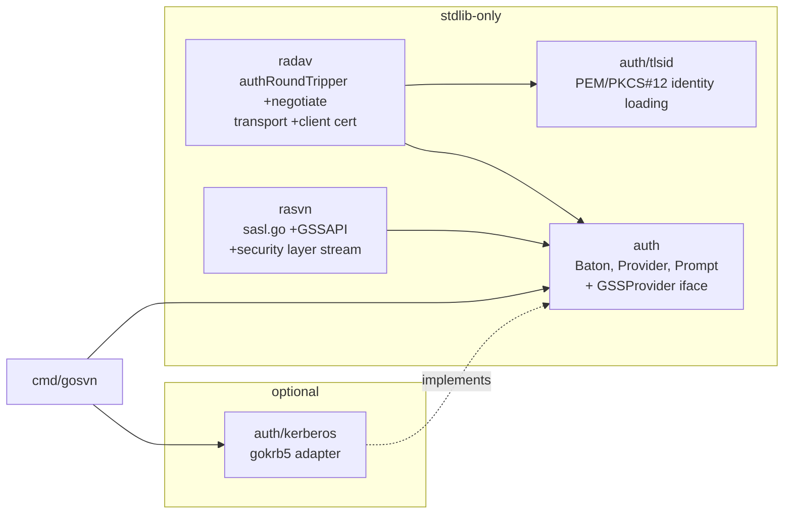

# Design: Kerberos/GSSAPI and client-certificate (mTLS) authentication

Status: proposed. Supersedes the `NTLM/Negotiate (Kerberos)` and
`SASL mechanisms other than …` bullets in `DESIGN.md` §1.2 once accepted.

This document specifies how go-svn authenticates to Subversion servers with

1. **Kerberos via GSSAPI** — HTTP `Negotiate` (SPNEGO, RFC 4559) for
   `http(s)://` and the SASL `GSSAPI` mechanism (RFC 4752) for `svn://`, and
2. **Client-side TLS certificates (mTLS)** for `https://`,

while keeping `CGO_ENABLED=0` mandatory and the pure-Go guarantee intact. The
Kerberos implementation is `github.com/otuschhoff/gokrb5/v8` (pure Go, Go 1.26).

---

## 1. Goals and non-goals

### 1.1 Goals

* `gosvn` authenticates to `mod_dav_svn` behind `mod_auth_gssapi` /
  `mod_auth_kerb` / IIS-style `Negotiate`, and to `svnserve --sasl` offering
  `GSSAPI`, using an existing ticket cache (`kinit`, `KRB5CCNAME`), a keytab, or
  (opt-in) a password — with no MIT/Heimdal library, no SSPI, no `import "C"`.
* `gosvn` presents a client certificate when an `https://` server requests one,
  honouring the reference client's `servers` options (`ssl-client-cert-file`,
  `ssl-client-cert-password`, `store-ssl-client-cert-pp*`) and auth-cache kinds
  (`svn.ssl.client-cert`, `svn.ssl.client-passphrase`).
* Both features are **optional at link time**. Callers who do not import the
  Kerberos package do not link gokrb5; mTLS needs only the standard library
  (plus one small module for PKCS#12, see §9).
* Interoperates with the reference `svn` client's configuration and auth cache
  so users can switch clients without reconfiguring.
* Fail closed: mutual authentication, integrity, and (where available)
  confidentiality are requested by default; weak enctypes are refused.

### 1.2 Non-goals

* NTLM, NEGOEX/PKU2U, IAKERB. `Negotiate` challenges are answered with
  Kerberos only; a server that insists on NTLM fails with `ErrRANotAuthorized`.
* Windows LSA credential cache (`API:`/`MSLSA:`) and macOS `KCM:`/`API:` caches.
  gokrb5 reads MIT `FILE:` caches only; other cache types are reported with a
  clear error. Keytab and password login are the alternatives.
* Client certificates from OS key stores (Keychain, CryptoAPI, PKCS#11).
  PEM and PKCS#12 files only.
* Kerberos for `svn+ssh://`. Tunnels keep using `EXTERNAL`; GSSAPI key exchange
  inside SSH is the tunnel program's business.
* `Negotiate` to a TLS-terminating **CONNECT proxy**. `net/http` performs the
  CONNECT handshake without exposing 407 challenges to a `RoundTripper`.
  `Proxy-Authenticate: Negotiate` is supported for plain-HTTP-through-proxy only.
* Server-side (acceptor) support. go-svn has no server.

---

## 2. Reference behaviour

| Aspect | Reference (`libsvn_ra_serf` / `libsvn_ra_svn`) | go-svn target |
|--------|-----------------------------------------------|---------------|
| HTTP scheme selection | `http-auth-types` (servers file), default `basic;digest;negotiate;ntlm` | same option; `ntlm` accepted and ignored |
| HTTP SPN | `HTTP/<hostname>` (serf, via GSSAPI `gss_import_name` `HTTP@host`) | `HTTP/<lower(hostname)>`, no rDNS canonicalisation |
| HTTP mutual auth | verified when the server returns a final token | verified when present; `RequireMutual` makes it mandatory |
| HTTP per-request behaviour | serf authenticates per connection; sends a fresh token when challenged | fresh context per request, sent preemptively once an origin is known to use Negotiate |
| svn:// mechanism list | Cyrus SASL; `GSSAPI` preferred when present | `GSSAPI` preferred when a GSS provider is configured |
| svn:// SPN | Cyrus `sasl_client_new("svn", hostname, …)` → `svn/<hostname>` | `svn/<lower(hostname)>` |
| svn:// security layer | negotiated per RFC 4752 within `min-encryption`/`max-encryption` (svnserve.conf) | supports none/integrity/confidentiality; client policy in §6.3 |
| client cert file | PKCS#12 (`ssl-client-cert-file`) | PKCS#12 **and** PEM (auto-detected) |
| client cert passphrase | `ssl-client-cert-password`, cache `svn.ssl.client-passphrase` (realm = file path), prompt | identical |
| client cert path cache | `svn.ssl.client-cert` (realm = `https://host:port`) — written only by prompt providers | identical |

---

## 3. Architecture



Design rule: **protocol packages never import gokrb5.** They program against a
small GSS interface in `auth`; `auth/kerberos` is the only package that imports
`github.com/otuschhoff/gokrb5/v8/...`. This mirrors the `wc.Driver`/SQLite
isolation in `DESIGN.md` §9.

---

## 4. Package layout (additions)

```
auth/
├── auth.go            # + GSSProvider, GSSContext, GSSOptions, Baton.GSS
├── gss_fake.go        # (test-only, _test.go) deterministic fake provider
├── kerberos/          # imports gokrb5; optional
│   ├── kerberos.go    # New(Options) → *Provider (implements auth.GSSProvider)
│   ├── spnego.go      # SPNEGO initiator for HTTP Negotiate
│   ├── krb5mech.go    # raw KRB5 mechanism initiator (RFC 4121) for SASL GSSAPI
│   ├── ccache.go      # KRB5CCNAME / KRB5_CONFIG / KRB5_CLIENT_KTNAME resolution
│   └── ticket_source.go # TicketSource iface; client-backed and static (tests)
└── tlsid/
    ├── identity.go    # Load(path, passphraseFn) → *tls.Certificate (PEM | PKCS#12)
    └── pkcs12.go      # thin wrapper around software.sslmate.com/src/go-pkcs12
radav/
├── authrt.go          # + "negotiate" scheme, per-origin negotiate state
├── negotiate.go       # token framing, mutual-auth verification, channel binding
└── transport.go       # + DialTLSContext with GetClientCertificate + passphrase flow
rasvn/
├── sasl.go            # + GSSAPI mechanism selection (RFC 4752 exchange)
└── sasl_layer.go      # length-prefixed wrap/unwrap io.ReadWriteCloser
internal/testutil/servers/
├── httpd.go           # + HTTPAuthNegotiate, ClientCA/RequireClientCert options
├── svnserve.go        # + SASL (GSSAPI) options
└── kdc.go             # tagged: locate/skip external KDC (integration only)
```

---

## 5. Core abstractions

### 5.1 `auth` — GSS interface (stdlib only)

```go
// GSSMechanism selects the wire format of context tokens.
type GSSMechanism uint8

const (
    GSSSPNEGO GSSMechanism = iota + 1 // RFC 4178 NegTokenInit/NegTokenResp (HTTP Negotiate)
    GSSKRB5                            // RFC 4121 raw Kerberos tokens (SASL GSSAPI)
)

// GSSOptions describes one context establishment.
type GSSOptions struct {
    Mechanism       GSSMechanism
    Target          string // "HTTP/host" or "svn/host"; service/host form, realm optional
    Mutual          bool   // request GSS_C_MUTUAL_FLAG (default true in callers)
    Integrity       bool   // request GSS_C_INTEG_FLAG
    Confidentiality bool   // request GSS_C_CONF_FLAG
    Delegate        bool   // request GSS_C_DELEG_FLAG (off by default)
    // ChannelBinding carries RFC 5929 tls-server-end-point application data
    // when the transport is TLS; nil otherwise.
    ChannelBinding []byte
}

// GSSContext is one security context. Step is called until done; Wrap/Unwrap
// are valid only after done. Implementations are not safe for concurrent use.
type GSSContext interface {
    // Step consumes a peer token (nil for the first call) and returns the next
    // token to send. done reports that the context is fully established.
    Step(ctx context.Context, input []byte) (output []byte, done bool, err error)
    // Established reports whether the local side has verified the peer.
    Established() bool
    // Wrap/Unwrap provide RFC 4121 per-message protection.
    Wrap(message []byte, confidential bool) ([]byte, error)
    Unwrap(token []byte) (message []byte, confidential bool, err error)
    // MaxWrapSize returns the largest plaintext that fits one Wrap token.
    MaxWrapSize() int
    // InitiatorName returns the authenticated client principal (for logging
    // and svn:// authzid), e.g. "alice@EXAMPLE.COM".
    InitiatorName() string
    Close() error
}

// GSSProvider creates initiator contexts. Implementations must be safe for
// concurrent use; one Provider is shared by all sessions of a Baton.
type GSSProvider interface {
    NewInitiator(ctx context.Context, options GSSOptions) (GSSContext, error)
}

type Baton struct {
    Providers      []Provider
    Prompt         Prompt
    StorePasswords bool
    StorePlaintext PlaintextPolicy
    GSS            GSSProvider // nil → Negotiate and SASL GSSAPI are not offered
}
```

Error contract: `NewInitiator` returns `svn.ErrRASerfGSSAPIInitialisationFailed`
(wrapping the cause) when no credential is available (no ccache, expired TGT,
unreadable keytab, KDC unreachable). `Step` returns `svn.ErrAuthnFailed` for a
peer rejection or a token that fails verification. Callers map these to
`ErrRANotAuthorized` where the existing code does so for Basic/Digest/CRAM-MD5.

`Prompt` gains no new callbacks for Kerberos: password-based login (§5.2) reuses
`Prompt.Simple` with the realm string `<krb5:REALM>`. Nothing Kerberos-related is
ever written to the disk auth cache.

### 5.2 `auth/kerberos` — gokrb5 adapter

```go
type Options struct {
    // Krb5Conf overrides KRB5_CONFIG; empty → KRB5_CONFIG, then platform default
    // (/etc/krb5.conf; %ProgramData%\MIT\Kerberos5\krb5.ini on Windows).
    Krb5Conf string
    // CCache overrides KRB5CCNAME. Only FILE: caches are supported.
    CCache string
    // Keytab overrides KRB5_CLIENT_KTNAME; when set, Principal selects the entry.
    Keytab string
    // Principal is "user@REALM"; required with Keytab or Password login, optional otherwise.
    Principal string
    // PasswordLogin enables an AS exchange with a password from Prompt.Simple
    // (realm "<krb5:REALM>") when no cache/keytab credential is usable.
    PasswordLogin bool
    // AllowWeakCrypto permits rc4-hmac and des3 session keys. Default false.
    AllowWeakCrypto bool
    // RequireMutual makes a missing acceptor reply an error (HTTP only).
    RequireMutual bool
    // Logger receives non-secret diagnostics.
    Logger *slog.Logger
    // TicketSource replaces the KDC client (tests inject static tickets).
    TicketSource TicketSource
}

// TicketSource yields a service ticket and session key for an SPN.
type TicketSource interface {
    ServiceTicket(ctx context.Context, spn string) (messages.Ticket, types.EncryptionKey, error)
    Principal() (types.PrincipalName, string) // client name, realm
}

func New(options Options, prompt *auth.Prompt) (*Provider, error)
func (p *Provider) NewInitiator(ctx context.Context, o auth.GSSOptions) (auth.GSSContext, error)
func (p *Provider) Close() error // stops TGT renewal goroutines
```

Credential resolution order (first that yields a usable TGT wins; each failure is
logged at debug level, the final error lists all attempts):

1. `Options.CCache` / `KRB5CCNAME` / `credentials.DefaultCCacheName()` → `credentials.LoadCCache` → `client.NewFromCCache`. If the cache's TGT is expired, continue.
2. `Options.Keytab` / `KRB5_CLIENT_KTNAME` / krb5.conf `default_client_keytab_name` → `client.NewWithKeytab(user, realm, kt, cfg)`, `Login()`.
3. If `PasswordLogin`: `Prompt.Simple(ctx, "<krb5:REALM>", defaultUser, maySave=false)` → `client.NewWithPassword(...)`, `Login()`. Never saved.

The `*client.Client` is created lazily on the first `NewInitiator` and cached in
the Provider for its lifetime; gokrb5 renews TGTs for password/keytab clients.
The client is constructed with `client.DisablePAFXFAST(false)` defaults and, when
`!AllowWeakCrypto`, the krb5 config's `permitted_enctypes`/`default_tgs_enctypes`
are intersected with `{aes128-cts-hmac-sha1-96, aes256-cts-hmac-sha1-96,
aes128-cts-hmac-sha256-128, aes256-cts-hmac-sha384-192}` before the client is built.

#### SPNEGO initiator (HTTP)

Built on `spnego.SPNEGOClientWithOptions(cl, spn, spnego.KRB5TokenAPREQOptions{...})`:

* `GSSAPIFlags` from `GSSOptions` (`ContextFlagMutual|Integ|Conf`, `Deleg` if requested);
  `ChannelBindings` from `gssapi.TLSServerEndPoint` data when `ChannelBinding != nil`;
  `Delegate` gated on the ticket's `ok-as-delegate` flag unless `ForceDelegation`.
* `Step(nil)` → `InitSecContext()` → `Marshal()`; `done=false`.
* `Step(token)` → `SPNEGOToken.Unmarshal` → `ContinueSecContext`; on
  `NegStateAcceptCompleted` verify the AP-REP and MechListMIC, `done=true`,
  `Established()=true`. `NegStateReject` → `ErrAuthnFailed`.
* `Wrap`/`Unwrap` delegate to `SecurityContext()`; unused by HTTP but keeps one
  interface.

#### Raw KRB5 initiator (SASL GSSAPI)

RFC 4752 requires bare RFC 4121 tokens, not SPNEGO. Built on
`spnego.NewKRB5TokenAPREQWithOptions(cl, tkt, key, options)`:

* `Step(nil)` returns the marshalled `KRB5Token` (InitialContextToken with the
  KRB5 OID and `TOK_ID_KRB_AP_REQ`). The authenticator (subkey, seq number) is retained.
* `Step(apRepToken)` unmarshals a `KRB5Token`, requires `IsAPRep()`, runs
  `APRep.Verify(authenticator, sessionKey)`, and creates
  `gssapi.NewSecurityContext(acceptorSubkeyOrSessionKey, initiator=true,
  sendSeq, recvSeq, acceptorSubkey)`. `done=true`.
* `Wrap`/`Unwrap`/`MaxWrapSize` delegate to the `SecurityContext`.

If the fork lacks a convenient client-side helper for the AP-REP leg, add one
upstream in gokrb5 (`spnego.KRB5Token.VerifyAPRep(authenticator, key)`) rather
than reimplementing crypto in go-svn. The user owns the fork, so this is the
preferred path (see §11).

### 5.3 `auth/tlsid` — client identity loading (stdlib + PKCS#12 decoder)

```go
// PassphraseFunc is called at most maxPassphraseAttempts times per Load.
type PassphraseFunc func(ctx context.Context, attempt int) (passphrase string, err error)

// Load parses a PEM bundle (certificate chain + private key, key optionally
// PKCS#8-encrypted) or a PKCS#12 archive, detected by content, and returns a
// tls.Certificate with Leaf populated. Passphrase is requested only when the
// input is encrypted. Wrong passphrases return ErrBadPassphrase and retry.
func Load(ctx context.Context, path string, passphrase PassphraseFunc) (*tls.Certificate, error)

var ErrBadPassphrase = errors.New("tlsid: incorrect passphrase")
```

PEM support uses `encoding/pem`, `crypto/x509` (`ParsePKCS8PrivateKey`,
`ParseECPrivateKey`, `ParsePKCS1PrivateKey`) and, for encrypted PKCS#8
(PBES2/PBKDF2), the same PKCS#12 module's `pkcs8` helpers. Legacy
`Proc-Type: ENCRYPTED` PEM (OpenSSL "traditional" format) is **not** supported;
the error message tells the user to convert with `openssl pkcs8 -topk8`.

PKCS#12 uses `software.sslmate.com/src/go-pkcs12` (`DecodeChain`), which handles
modern AES-256-CBC/PBKDF2/SHA-256 archives produced by OpenSSL 3 as well as the
legacy RC2/3DES ones. `golang.org/x/crypto/pkcs12` was rejected because it
decodes legacy ciphers only and is frozen.

---

## 6. Protocol integration

### 6.1 HTTP `Negotiate` in `radav/authrt.go`

**Scheme admission.** `selectAuthChallenge` gains a `negotiate` branch ranked
above digest (`challengeRank` → 4) when both hold:

* `roundTripper.gss != nil` (from `callbacks.Auth.GSS`), and
* `negotiate` is listed in the effective `http-auth-types` (see §7).

`Negotiate` challenges carry no `realm=` parameter, so the existing
`parameters["realm"] == ""` skip must be bypassed for this scheme. A challenge
with a token (`Negotiate <b64>`) on a 401 is a continuation; without a token it is
an initial challenge.

**State.** `authState` gains `gss auth.GSSContext` and `negotiateOrigin bool`.
Per origin (`authOriginKey`) the round tripper remembers only *that* the origin
uses Negotiate; the context itself is per request and dropped afterwards.

**Request flow** (inside the existing `for attempt < maxAuthAttempts` loop):

1. If the origin is known to use Negotiate, before the first send create a
   context (`Mechanism: GSSSPNEGO`, `Target: "HTTP/"+host`, `Mutual: true`,
   `Integrity: true`, `ChannelBinding:` §6.4) and set
   `Authorization: Negotiate <base64(Step(nil))>`.
2. Send. If the response is `401` with `WWW-Authenticate: Negotiate [token]`:
   * no context yet → create one as in step 1, `Step(nil)`, retry;
   * context exists and token present → `Step(token)`; if `!done` retry with the
     output token (multi-leg), if `done` and a non-empty output exists retry once;
   * context exists and no token → server rejected: mark credentials rejected,
     fall back to the next admissible scheme in the same challenge set (Digest/Basic)
     or fail with `ErrRANotAuthorized`.
3. On any non-401 response: if `WWW-Authenticate: Negotiate <token>` is present,
   `Step(token)` must return `done` and `Established()`; failure →
   `ErrAuthnFailed` (the response body is drained and closed). If absent and
   `RequireMutual`, fail the same way. Otherwise `remember(originKey, negotiateOrigin=true)`.
4. `Proxy-Authenticate: Negotiate` mirrors the above with `Target: "HTTP/"+proxyHost`
   and the `Proxy-Authorization` header, plain-HTTP proxies only.

Tokens are never logged; `Logger` records scheme, host, `InitiatorName()`, and
the outcome at debug level.

**Body replay** relies on the existing `cloneAuthRequest`/`GetBody` contract; no change.

**SPN.** `HTTP/` + lower-cased `URL.Hostname()` (IPv6 literal rejected with a
config error — Kerberos needs a name). No reverse DNS. An explicit override is
available only through `kerberos.Options.SPNOverride map[host]spn` for broken
DNS setups; there is no servers-file key for it because the reference client has none.

### 6.2 SASL `GSSAPI` in `rasvn/sasl.go`

Mechanism preference in `runSASL` becomes:

```
ANONYMOUS (if offered)
EXTERNAL  (if tunnel)
GSSAPI    (if offered and conn.callbacks.Auth.GSS != nil)
CRAM-MD5
PLAIN     (if tunnel)
```

RFC 4752 exchange over the ra_svn SASL framing (`( GSSAPI ( <b64> ) )`,
`( step ( <b64> ) )`, `<b64>`, `( success ( [<b64>] ) )`):

1. `ctx := GSS.NewInitiator(GSSOptions{Mechanism: GSSKRB5, Target: "svn/"+host,
   Mutual: true, Integrity: true, Confidentiality: policy(§6.3)})`.
2. Initial response = base64(`Step(nil)`).
3. Each `step` payload is base64-decoded and fed to `Step`. While `!done`, the
   output is sent as the client response.
4. After `done`, the next `step` payload is the server's **wrapped**
   security-layer offer: `Unwrap` → 4 bytes: `[bitmask][maxsize:3]`.
   Choose the strongest layer permitted by both sides (§6.3); reply with
   `Wrap([chosen][our-max:3] || authzid)` where `authzid` is empty (svnserve derives
   the user from the Kerberos principal; sending a different authzid is rejected).
5. Expect `( success ( ) )`. A `failure` maps to `ErrAuthnFailed` and is
   **not** retried with other credentials (there is no other Kerberos credential).

If the chosen layer is not `none`, `conn.stream`, `conn.reader`, and
`conn.writer` are swapped for a `saslLayerConn` (`rasvn/sasl_layer.go`) that
frames every write as `uint32 big-endian length || Wrap(chunk, confidential)`
with `chunk ≤ min(serverMax, MaxWrapSize())`, and on read consumes one
length-prefixed token at a time, `Unwrap`s it, and buffers the plaintext.
Malformed lengths (`> serverMax` or `> 16 MiB`) are protocol errors that close
the connection. The swap happens before `readResponse()` of the repository
information tuple, matching `libsvn_ra_svn` where the SASL stream wraps the
connection immediately after success.

`conn.username` is set from `InitiatorName()` for notifications and lock owner
display; `conn.password` stays empty.

### 6.3 svn:// security-layer policy

Client bounds are derived from the transport:

| Transport | Offered by client | Rationale |
|-----------|-------------------|-----------|
| plain TCP | confidentiality > integrity > none | svnserve.conf `min-encryption` defaults to 0 so servers accept any; prefer encryption |
| tunnel (`svn+ssh`) | not applicable — GSSAPI is not used over tunnels | — |

The server's offer is intersected with the client's set; if empty →
`ErrRANotAuthorized: no acceptable SASL security layer`. A servers-file option
`gosvn-sasl-min-encryption` is deliberately **not** added; embedders needing to
forbid plaintext set `kerberos.Options.RequireConfidentiality`.

### 6.4 Channel binding (HTTPS + Negotiate)

When the underlying connection is TLS, `radav` computes
`tls-server-end-point` bindings (RFC 5929: hash of the server leaf certificate
using its signature hash, SHA-256 for MD5/SHA-1-signed certs) from
`http.Response.TLS`/the dialed `tls.ConnectionState` and passes them as
`GSSOptions.ChannelBinding`. Acceptors that do not check bindings ignore them
(RFC 4121 §4.1.1.2), so this is always on; IIS "Extended Protection: Required"
and Windows servers with `SuppressExtendedProtection=0` are satisfied. Because
the HTTP client may reuse or open connections between the challenge and the
retry, the binding is taken from the connection that carried the challenge and
the retry is pinned to the same connection via `httptrace.GotConnInfo`; if the
transport hands out a different connection, the context is discarded and
re-created (one extra round trip, no security impact).

### 6.5 Client certificates in `radav/transport.go`

`newTransport` installs `httpTransport.DialTLSContext` (and sets
`ForceAttemptHTTP2 = true`, `TLSClientConfig.NextProtos = []string{"h2","http/1.1"}`)
whenever any of these is true for the host group:

* `ssl-client-cert-file` is set,
* `callbacks.Auth` has providers (the disk cache may hold `svn.ssl.client-cert`), or
* `Prompt.SSLClientCert != nil`.

The dialer clones the base `tls.Config` per connection and sets
`GetClientCertificate` to a closure capturing the request `ctx`, so passphrase
prompts are cancellable and only happen when the server actually sends a
`CertificateRequest`. Resolution order inside the callback:

1. **Path**: `ssl-client-cert-file` → cache `Get(SSLClientCert, realm)` with
   `realm = "https://host:port"` → `Prompt.SSLClientCert(ctx, realm, maySave)`.
   `Credentials.Certificate` holds the path. No path → return
   `&tls.Certificate{}` (empty; lets the server decide, matching the reference).
2. **Identity**: `tlsid.Load(ctx, path, passphraseFn)` where `passphraseFn`
   tries in order `ssl-client-cert-password` → cache
   `Get(SSLClientCertPassword, realm=path)` → `Prompt.SSLClientCertPassword(ctx, path, maySave)`;
   up to 3 attempts, each `ErrBadPassphrase` marks the previous source rejected.
3. **Compatibility**: `cri.SupportsCertificate(cert)` must succeed; otherwise
   the identity is dropped with a debug log and an empty certificate is
   returned (server typically answers 403/`bad certificate`, which is surfaced
   as `ErrRASerfSSLCertUntrusted`-adjacent `svn.ErrRADAVRequestFailed` with the
   TLS alert text).
4. **Saving**: on a successful handshake (observed in `RoundTrip` via
   `response.TLS != nil`), `SaveCredentials` is called for the path
   (`MaySave`) and for the passphrase subject to `store-ssl-client-cert-pp`
   and `store-ssl-client-cert-pp-plaintext` (`yes|no|ask`, reusing
   `PlaintextPolicy`/`Prompt.AllowPlaintext` with the passphrase-specific
   question text).

Loaded identities are cached in the transport for its lifetime keyed by path,
so repeated handshakes (connection pool churn) never re-prompt. Private keys are
never logged, serialised, or written to the auth cache; only the path and the
passphrase are, exactly as the reference client does.

The existing `certificateVerifier`/`trustRoundTripper` path is unchanged and
composes: the same per-connection `tls.Config` clone keeps `VerifyConnection`.

---

## 7. Configuration and CLI

### 7.1 servers file (`[global]` and groups) — all reference-compatible

| Option | Values | Consumer |
|--------|--------|----------|
| `http-auth-types` | `;`-separated subset of `basic`, `digest`, `negotiate`, `ntlm` (default: all) | `radav.selectAuthChallenge` |
| `ssl-client-cert-file` | path (PEM or PKCS#12) | `radav` §6.5 |
| `ssl-client-cert-password` | string | `radav` §6.5 |
| `store-ssl-client-cert-pp` | `yes`/`no` (default `yes`) | `radav` §6.5 |
| `store-ssl-client-cert-pp-plaintext` | `yes`/`no`/`ask` (default `ask`) | `radav` §6.5 |

`config/defaults.go` gains the four `ssl-client-cert*`/`store-ssl-client-cert-pp*`
and `http-auth-types` entries as commented defaults, matching the reference
template text.

### 7.2 Environment (Kerberos, MIT-compatible)

`KRB5_CONFIG`, `KRB5CCNAME` (`FILE:` only), `KRB5_CLIENT_KTNAME`, `KRB5_KTNAME`.

### 7.3 `gosvn` flags

No new flags are required for parity with `svn`. Two optional extensions:

* `--krb5-principal user@REALM` — selects a keytab entry / password-login identity.
* `--krb5-password-login` — enables `Options.PasswordLogin` (interactive only;
  refused together with `--non-interactive`).

`makeCallbacks()` constructs `kerberos.New(...)` **only** when
`http-auth-types` may include `negotiate` for some host or an `svn://` URL is in
play — i.e. always, cheaply: `New` does no I/O; credentials are resolved lazily.
Construction failure (e.g. unparsable `krb5.conf`) is logged and leaves `GSS` nil
so Basic/Digest/CRAM-MD5 keep working.

### 7.4 Library API

```go
gss, _ := kerberos.New(kerberos.Options{}, &prompt) // env-driven defaults
callbacks := &ra.Callbacks{Auth: auth.Baton{GSS: gss, Providers: ..., Prompt: prompt}}
```

`ra.Callbacks` is unchanged; everything hangs off `auth.Baton`.

---

## 8. Test strategy

### 8.1 Unit (default CI, `CGO_ENABLED=0`, no network, no KDC)

* `auth`: a `fakeGSSProvider` (test file) whose tokens are `"C1"`, `"S1"`,
  `"C2"`, whose `Wrap` is `len || payload || checksum(crc32)` and whose `Unwrap`
  verifies it. Used by both protocol packages.
* `radav/authrt_test.go`: httptest server issuing `401 Negotiate`, continuation
  legs, mutual reply on 200, reject (401 without token) → Digest fallback,
  `http-auth-types=basic;digest` → Negotiate ignored, preemptive header on the
  second request, body replay with `GetBody`, `RequireMutual` failure path,
  proxy 407 over plain HTTP.
* `radav/transport_test.go`: httptest TLS server with `ClientAuth: RequireAndVerifyClientCert`;
  PEM plain / PEM encrypted PKCS#8 / PKCS#12 (fixtures generated by a Go
  `testing` helper using `go-pkcs12.Encode`, not checked in as binaries);
  passphrase from config / cache / prompt; wrong passphrase retry; save policy
  matrix; `SupportsCertificate` mismatch; ensure prompts do not fire when the
  server does not request a certificate.
* `rasvn/sasl_test.go`: scripted svnserve peer offering `( GSSAPI CRAM-MD5 )`;
  RFC 4752 layer negotiation (none/integ/conf, empty intersection), framing of
  multi-chunk writes, oversize length rejection, `failure` mapping, and that the
  repository tuple is read through the wrapped stream.
* `auth/kerberos`: crypto-real tests **without a KDC** using a static
  `TicketSource`: `messages.NewTicket(...)` with a test keytab produces a
  ticket + session key; the SPNEGO/KRB5 initiators are driven against
  `service.VerifyAPREQ`/`spnego.SPNEGOService` acceptors from gokrb5 in-process.
  Covers AP-REP verification, MechListMIC, channel-binding mismatch rejection,
  Wrap/Unwrap round trip and sequence-number enforcement, weak-enctype refusal.
* `auth/tlsid`: format detection, all key types (RSA, ECDSA P-256/384, Ed25519),
  legacy-PEM rejection message, chain ordering.
* Fuzz targets: `FuzzNegotiateChallenge` (header parsing), `FuzzSASLLayerFrame`
  (length-prefixed reader), `FuzzTLSIDLoad` (PEM/PKCS#12 parser front door).

### 8.2 Integration (`-tags integration`, skips cleanly when tools are absent)

Extend `internal/testutil/servers`:

* `HTTPDOptions{Auth: HTTPAuthNegotiate, Keytab, Realm}` → `mod_auth_gssapi`
  config (`GssapiCredStore keytab:…`, `GssapiUseSessions Off`) — requires
  `libapache2-mod-auth-gssapi`.
* `HTTPDOptions{ClientCA, RequireClientCert}` → `SSLVerifyClient require`,
  `SSLCACertificateFile`; test-generated CA + client cert (PEM and PKCS#12).
* `SvnserveOptions{SASL: true, MinEncryption, MaxEncryption, Keytab}` →
  `[sasl] use-sasl = true` plus a `svn.conf` for Cyrus in `SASL_CONF_PATH`
  (`mech_list: GSSAPI`); requires `libsasl2-modules-gssapi-mit`.
* `kdc.go`: a `docker compose` service (MIT krb5 KDC, realm `GOSVN.TEST`) under
  `testdata/docker/kdc/`, provisioning `alice`, `HTTP/localhost`, `svn/localhost`
  keytabs; `KRB5_CONFIG`/`KRB5CCNAME` pointed at temp files; `kinit` performed
  by gokrb5 itself (password login) so the runner needs no MIT client tools.
  gokrb5's own CI already pins a Samba AD image — reuse its realm fixtures where
  practical.

CI: a new `integration-auth` job on `ubuntu-latest` installing the modules above;
it runs `go test -tags integration ./radav ./rasvn ./auth/kerberos -run 'Negotiate|GSSAPI|ClientCert'`.
Cross-check with the reference `svn` client: authenticate once with `svn info`
against the same servers to prove the config and auth cache written by go-svn
are consumed by `svn`, and vice versa (`svn.ssl.client-passphrase` round trip).

### 8.3 Cross-platform

Windows: unit suite must compile and pass (`FILE:` ccache path handling,
`%ProgramData%` krb5.ini default, PKCS#12 fixtures). LSA cache unsupported →
`TestWindowsLSACacheUnsupportedMessage` asserts the actionable error text.

---

## 9. Dependencies

Update `DESIGN.md` §9 table with:

| Module | Used by | Why stdlib is insufficient | Isolation |
|--------|---------|----------------------------|-----------|
| `github.com/otuschhoff/gokrb5/v8` | `auth/kerberos` | Kerberos/GSSAPI/SPNEGO (RFC 4120/4121/4178/4752) in pure Go | Only `auth/kerberos` imports it; protocol packages use `auth.GSSProvider`. Not linked unless imported (`cmd/gosvn` does). |
| `software.sslmate.com/src/go-pkcs12` | `auth/tlsid` | PKCS#12 and PBES2-encrypted PKCS#8 decoding; stdlib has neither, `x/crypto/pkcs12` is legacy-only | Only `auth/tlsid`; `radav` imports `tlsid` (tiny). |

Transitive additions from gokrb5 v8.5.x: `github.com/jcmturner/{gofork,aescts,dnsutils,goidentity,rpc}`, `github.com/hashicorp/go-uuid`, `golang.org/x/crypto`, `golang.org/x/net`. All pure Go. `govulncheck` in CI covers them.

Remove `SASL/GSSAPI libs` from the "explicitly not used" sentence in §9 and
replace it with "GSSAPI bindings (cgo) and SSPI".

---

## 10. Security considerations

* **Fail closed.** Mutual auth requested always; integrity always; a token that
  fails verification aborts the request even if the HTTP status is 2xx.
* **No secrets at rest.** Kerberos never touches `~/.subversion/auth`. Client
  cert private keys are never cached; passphrases follow the reference policy
  (`store-ssl-client-cert-pp*`), stored as `passtype=simple` only when permitted.
* **No secrets in logs.** Tokens, keys, passphrases, and `Authorization` headers
  are excluded from `slog` output and from error strings (`%w` wraps codes, not
  token bytes).
* **Enctypes.** RC4-HMAC and DES3 are refused by default (`AllowWeakCrypto`).
* **SPN construction.** Hostname from the URL only; no rDNS; lower-cased; IP
  literals rejected. Prevents DNS-spoofing into a ticket for the wrong service.
* **Channel binding** to TLS on by default (§6.4).
* **Replay.** Per-request fresh AP-REQ; the server's replay cache protects the
  acceptor; gokrb5's `SecurityContext` enforces sequence numbers on the SASL layer.
* **Delegation** off by default; when on, gated on `ok-as-delegate`.
* **DoS bounds.** SASL layer frames capped at the negotiated max and 16 MiB;
  Negotiate tokens capped at 64 KiB before base64 decoding; `maxAuthAttempts` unchanged.
* **Memory hygiene.** Passphrases and password-login secrets are zeroed after
  use where Go permits (byte slices, not strings, in `tlsid` and `kerberos`).
* **TLS** stays `MinVersion: TLS1.2`; client-cert dialing keeps `VerifyConnection`
  server trust logic intact.

---

## 11. Open decisions

1. **gokrb5 helper for raw KRB5 initiator.** Add `spnego.KRB5Token.VerifyAPRep`
   and a `krb5.NewInitiator(cl, spn, options) gssapi.ContextMechanism` upstream
   in the fork versus implementing the AP-REP verification glue in
   `auth/kerberos/krb5mech.go`. Recommendation: upstream; it benefits
   `spnego.Negotiator` users too and keeps crypto out of go-svn.
2. **Preemptive Negotiate tokens.** Per-request preemption (this spec) versus
   401-first every time (simpler, +1 RTT per request, more server replay-cache
   pressure). Recommendation: preemptive, with a `kerberos.Options.NoPreemptive`
   escape hatch for servers with strict replay caches.
3. **Password login default.** `PasswordLogin=false` by default so that a
   missing ticket produces a clear "run kinit" error instead of a prompt that
   users may mistake for HTTP Basic. `gosvn --krb5-password-login` enables it.
4. **PKCS#12 module.** `software.sslmate.com/src/go-pkcs12` (recommended) vs a
   minimal in-tree decoder. In-tree would need PBES2/PBKDF2/AES-CBC and legacy
   PKCS#12 KDF (RC2/3DES) — roughly 800 lines of security-sensitive code for a
   non-core feature; not worth it.
5. **Cache types beyond `FILE:`.** Out of scope now; revisit if gokrb5 grows
   `KCM:`/`API:` support. Windows users are pointed at keytab or password login.

---

## 12. Implementation plan

| Step | Deliverables | Acceptance |
|------|--------------|------------|
| A1 `auth` GSS interface | `GSSProvider`, `GSSContext`, `GSSOptions`, `Baton.GSS`; fake provider test helper | `go vet`, docs; no behaviour change when `GSS == nil` |
| A2 `auth/tlsid` | PEM/PKCS#12 loader, fixtures generator, fuzz target | unit tests for all key types and formats |
| A3 `radav` client certs | `DialTLSContext` + `GetClientCertificate` flow, config keys, cache/save policy | §8.1 transport tests green on all three OSes |
| A4 `radav` Negotiate | scheme admission, state machine, mutual verification, channel binding, proxy | §8.1 authrt tests with fake provider |
| A5 `rasvn` GSSAPI | RFC 4752 exchange, security-layer stream, preference order | §8.1 sasl tests with fake provider; existing CRAM-MD5 tests unchanged |
| A6 `auth/kerberos` | gokrb5 adapter: ccache/keytab/password, SPNEGO + raw KRB5 initiators, weak-crypto policy | in-process acceptor tests (no KDC) |
| A7 `cmd/gosvn` + config | flags, `makeCallbacks` wiring, `defaults.go`, README auth section, `docs/troubleshooting.md` Kerberos entries | manual: `kinit` + `gosvn info https://…` against mod_auth_gssapi |
| A8 Integration | `servers` harness options, KDC compose, `integration-auth` CI job, reference-client cross-check | job green; `svn` and `gosvn` consume each other's cache |
| A9 Docs | `DESIGN.md` §1.2/§4/§6.1/§6.2/§9 updates; `IMPLEMENTATION_PLAN.md` phase entry | review |

Steps A1–A5 are independent of gokrb5 and can land first behind the interface;
A6 introduces the dependency in one commit so the §9 table change is reviewable
in isolation.
