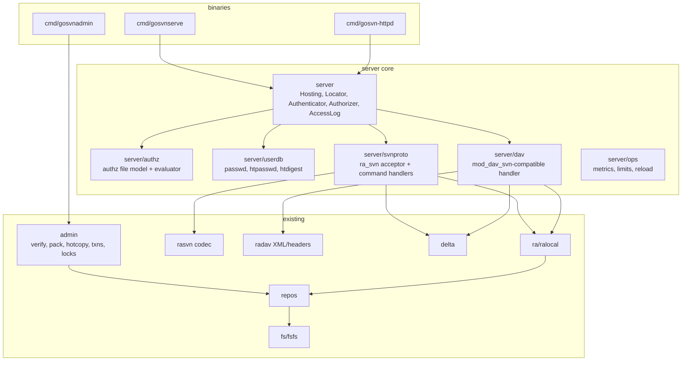

# Design: full Subversion server support

Status: proposed. Supersedes the `Server implementations (svnserve,
mod_dav_svn) — except the minimal in-process fakes used for tests` bullet in
`DESIGN.md` §1.2 once accepted.

This document scopes a pure-Go Subversion **server**: an `svnserve`-compatible
`svn://` daemon, a `mod_dav_svn`-compatible HTTP(S) server, and the
`svnadmin`-class administration tooling both depend on. It inventories what the
repository already provides, lists what is missing, and defines a phased plan
in which every phase ships something independently useful and testable with
the existing client and the reference `svn` client.

Companion document: `docs/design-kerberos-mtls.md` (client-side Kerberos/mTLS);
its `auth.GSSProvider` split is reused here for the server-side acceptor.

---

## 1. Goals and non-goals

### 1.1 Goals

* **G1 Drop-in for the reference servers on FSFS repositories.** A repository
  created or served by go-svn is byte-compatible with `svnadmin`, `svnserve`,
  and `mod_dav_svn` (formats 6–8 for write, 1–8 for read). Both server
  families can serve the same repository directory concurrently with go-svn
  because FSFS locking already follows APR's `fcntl` semantics.
* **G2 Protocol fidelity.** Reference clients 1.6–1.15 (`svn`, `svnsync`,
  `svnrdump`, TortoiseSVN, IDE plug-ins) work unchanged over `svn://`,
  `svn+ssh://` (`svnserve -t` mode), and `http(s)://` (HTTPv2 plus the HTTPv1
  read paths the client already relies on for discovery).
* **G3 Configuration compatibility.** `conf/svnserve.conf`, `conf/passwd`,
  `conf/authz`, `conf/hooks-env`, and the hook scripts are honoured as the
  reference server honours them. HTTP deployments use a small go-svn config
  (there is no Apache to read directives from) but the authz/passwd file
  formats are identical.
* **G4 Pure Go, single static binary**, `CGO_ENABLED=0`, cross-compiles to all
  platforms the client supports (including Windows and windows/arm64).
* **G5 Operable.** Structured access logs, metrics hooks, graceful shutdown,
  hot reload of authz/passwd, request limits, and TLS termination without a
  reverse proxy.
* **G6 Administration.** `svnadmin` parity for the commands operators use
  daily: `create`, `dump`, `load`, `verify`, `pack`, `hotcopy`, `lslocks`,
  `rmlocks`, `lstxns`, `rmtxns`, `setrevprop`, `setlog`, `setuuid`, `info`,
  `recover`, `upgrade`.

### 1.2 Non-goals

* BDB and FSX back-ends. FSFS only (as for `file://`).
* Being an Apache module or parsing `httpd.conf` directives. go-svn provides
  its own HTTP server; a mapping table of `SVN*` directives to go-svn options is
  documented for migration.
* Generic WebDAV interoperability (mounting repositories as network drives,
  `SVNAutoversioning`, DeltaV for non-Subversion clients). Only what Subversion
  clients send is accepted; other methods get `405`.
* HTTPv1 **commit** acceptance (`MKACTIVITY`/`CHECKOUT` state machine). Pre-1.7
  clients can read; they cannot commit. Mirrors the client-side decision in
  `DESIGN.md` §1.4.
* Write-through proxying (`SVNMasterURI`), multi-master, or distributed
  locking. Replication is done by the client-side `svnsync` equivalent
  (`gosvn sync`, phase 7), which needs no server support beyond
  `pre-revprop-change`.
* LDAP/Active Directory user databases, SQL user stores, OAuth. Users come
  from `passwd`, `htpasswd`/`htdigest` files, client certificates, Kerberos
  principals, or an embedder-supplied `Authenticator`.
* Web UI. Directory `GET` returns the same minimal XHTML listing `mod_dav_svn`
  does, nothing more.

---

## 2. What already exists (reusable as-is)

| Layer | Package | Reusable for the server | Notes |
|-------|---------|-------------------------|-------|
| Storage | `fs`, `fs/fsfs` | `fs.FS` (`BeginTxn`, `RevisionRoot`, `ChangeRevisionProp`, `Lock/Unlock/GetLock/GetLocks`), `fs.Root` (all node/history/mergeinfo queries), `fs.TxnRoot` (`MakeDir/MakeFile/Delete/Copy/ChangeNodeProp/ApplyText(Delta)`), `Transaction.Commit` with `db/write-lock` + conflict/out-of-date detection, `fsfs.conf` parsing, rep-cache, packed revprops, logical/physical addressing | Read formats 1–8; write 6–8; `Create` defaults to format 8 |
| Repository | `repos` | `Create/Open`, `GetCommitEditor` (runs `start-commit`, `pre-commit`, `post-commit`), `ChangeRevisionProp` (revprop hooks), `Lock/Unlock` (lock hooks), `RunHook` + `hooks-env`, `Log` incl. merged history, `GetLocations`, `GetLocationSegments`, `GetMergeinfo`, `GetInheritedProps`, `GetDeletedRev`, `DatedRevision`, `Dirent`, `Dump`, `Load` | Everything `svnserve/serve.c` and `mod_dav_svn` call in `libsvn_repos` for request handling is here |
| Local RA | `ra/ralocal` | Complete `ra.Session` over `repos`: reporter (`set-path/delete-path/link-path`) → editor drive for update/switch/status/diff, `Replay/ReplayRange`, `List`, commit, locks | The server-side command handlers are this package with a wire codec in front |
| Editor | `delta` | `Editor` interface, `PathDriver`, `DepthFilter`, `Cancel`, `Compose`, svndiff0/1/2 read **and** write, xdelta generator, `TreeBuilder` | Text deltas for update responses and commit ingestion |
| svn:// codec | `rasvn` | `Item`, `Encoder/Decoder` with DoS bounds (64 MiB strings, depth 64), editor↔wire **both directions** (`editor_wire.go` decodes server commands into an `Editor`; the commit driver encodes an `Editor` into commands), reporter vocabulary, CRAM-MD5 math, `net.Pipe`-scripted peers in `conn_test.go` | Server needs the mirror image of `conn.go`: read commands, write responses |
| HTTP codec | `radav` | OPTIONS header names, `SVN-*` header set, PROPFIND/multistatus types, every REPORT body the client sends, HTTPv2 commit sequence (POST create-txn, PUT/MKCOL/DELETE/COPY/PROPPATCH on `!svn/txr`, MERGE), LOCK/UNLOCK, namespace handling, `propertyColonEscape`, streaming `xml.Decoder` | Server parses what the client marshals and marshals what it parses |
| Config | `config` | INI parser with continuation lines, `[groups]`, comments preserved | Enough for `svnserve.conf`, `passwd`, `authz`, `hooks-env` |
| Auth | `auth` | Credential model, CRAM-MD5 primitives, (proposed) `GSSProvider` split | Server needs the acceptor side |
| Errors | `svn` | Full code table incl. `ErrRepos*`, `ErrFS*`, `ErrAuthz*`, `ErrRASvn*`, `ErrRADAV*`; `svn.Error` carries code+message for the wire | ra_svn `failure` tuples and DAV `<S:error>` bodies can be produced verbatim |
| Test assets | `testdata/`, `internal/testutil/servers`, `ra/conformance` | FSFS fixtures for every format, dumps, recorded ra_svn/DAV transcripts, httpd/svnserve harness that writes `svnserve.conf`/`passwd`/`httpd.conf`, RA conformance suite (reads, writes, locks, replay) | The conformance suite becomes the server's acceptance test by pointing `rasvn`/`radav` clients at the new server |

---

## 3. What is missing

| Area | Gap | Needed by |
|------|-----|-----------|
| Listeners & dispatch | No `net.Listener`/`http.Server` code, no ra_svn command loop, no DAV router | every server phase |
| ra_svn server | Greeting, capability negotiation, SASL **acceptor** (ANONYMOUS, CRAM-MD5, EXTERNAL, later GSSAPI), auth-request framing before each command, per-command handlers, server-driven editor for update/switch/status/diff/replay, commit ingestion (wire → `repos.GetCommitEditor`), lock-many/unlock-many, `failure` error tuples, tunnel (`-t`) and inetd (`-i`) modes | P2, P3 |
| DAV server | `!svn/` resource namespace (`me`, `rvr`, `rev`, `bc`, `bln`, `vcc`, `txr`, `txn`, `vtxr`, `vtxn`), OPTIONS/PROPFIND/GET/REPORT handlers, HTTPv2 write handlers, LOCK/UNLOCK with `If:`/`Lock-Token:`, `<S:error>` bodies, bulk **and** skelta update modes, chunked/streamed responses | P4, P5 |
| Authentication (server) | `passwd` parser, `htpasswd`/`htdigest` parsers (bcrypt/APR1-MD5/SHA1/crypt), HTTP Basic/Digest **acceptor**, SASL acceptors, Negotiate acceptor, client-cert → user mapping, anonymous policy | P1, P2, P4, P6 |
| Authorization | `authz` file parser (sections `[/path]`, `[repo:/path]`, `[groups]`, `[aliases]`, `glob:` rules, `$authenticated`/`$anonymous`, `~` negation, `@group`, `&alias`), rule evaluation with inheritance, path-tree lookups for update/log/list filtering (`svn_repos_authz_check_access` semantics), `anon-access`/`auth-access`, `force-username-case` | P1 onward |
| Admin | `verify`, `pack`, `hotcopy`, `recover`, `upgrade` (format 6→8, 1–5→6+ via dump/load fallback), `lstxns/rmtxns`, `lslocks/rmlocks`, `setrevprop/setlog` (with `--bypass-hooks`), `setuuid`, `info`, `freeze`, `rep-cache` rebuild, `build-repcache`, `svnadmin create --compatible-version` mapping | P0 |
| Operations | Access log, metrics interface, PID file, graceful shutdown/drain, config reload (SIGHUP/Windows event), request limits (`mod_dontdothat`-style guards), caching layer (fulltext/dir/revprop) | P1, P7 |
| Server config | go-svn HTTP server config format (repository parent path, per-location authz/passwd, TLS, listen addresses), `svnserve.conf` → runtime settings (`[general]`, `[sasl]`) | P1, P4 |
| Fixtures & harness | In-process server used by the client packages' tests (replacing some `httptest` hand-rolled handlers), reference-client-against-go-svn-server integration job | P2–P5 |

---

## 4. Architecture



Design rules:

1. **One request model, two codecs.** Both protocol front-ends translate wire
   requests into calls on an `ra.Session` obtained from `ra/ralocal` for the
   located repository, wrapped by an **authorizing session** that filters paths
   and rejects forbidden operations. Handlers never touch `fs` directly.
2. **Authz is enforced in one place.** `server.authorizedSession` implements
   `ra.Session`; it checks every path argument, filters `GetDir`/`List`/`Log`
   changed-paths, and installs a path-filtering `delta.Editor` in front of
   update/replay editors. Front-ends cannot forget a check because they never
   see the raw session.
3. **Protocol packages stay symmetric with their clients.** `server/svnproto`
   depends on `rasvn` for `Item` codec and editor wire encoding;
   `server/dav` depends on `radav` for XML types. Shared types that today are
   unexported in the client packages are exported (or moved to
   `rasvn/wire`, `radav/davxml`) rather than duplicated.
4. **Hooks, locks, and commits go through `repos`.** No server-only commit
   path; `file://` and remote commits are indistinguishable in the repository.

---

## 5. Package layout (additions)

```
admin/                       # library behind gosvnadmin; no I/O beyond the repo dir
├── verify.go                # revision walk, checksums, index consistency, rep-cache
├── pack.go                  # shard packing (revs + revprops) for formats 6–8
├── hotcopy.go               # consistent copy under write-lock (incremental)
├── txns.go                  # list/remove transactions
├── locks.go                 # list/remove locks (bypass hooks)
├── revprops.go              # setrevprop/setlog with --bypass-hooks
├── upgrade.go               # format 6/7 → 8 in place; 1–5 via dump/load
├── recover.go               # rebuild db/current, txn-current, min-unpacked-rev
└── info.go                  # svnadmin info fields
server/
├── server.go                # Hosting (repos root/parent-path), Locator, Options
├── session.go               # authorizedSession: ra.Session wrapper enforcing authz
├── authn.go                 # Authenticator iface; Anonymous, PasswdFile, Chain
├── accesslog.go             # slog-based structured access log
├── reload.go                # atomic reload of authz/passwd/svnserve.conf
├── authz/
│   ├── parse.go             # authz file → model (sections, groups, aliases, globs)
│   ├── eval.go              # access lookup: (repo, path, user) → read|write|none
│   └── tree.go              # per-user path trie with "any descendant readable" answers
├── userdb/
│   ├── passwd.go            # svnserve [users] plaintext file
│   ├── htpasswd.go          # $apr1$, {SHA}, bcrypt $2y$, crypt(3) DES
│   └── htdigest.go          # user:realm:HA1
├── svnproto/
│   ├── serve.go             # accept loop, greeting, capability negotiation
│   ├── sasl.go              # SASL acceptor: ANONYMOUS, CRAM-MD5, EXTERNAL (+GSSAPI P6)
│   ├── commands.go          # command table → handler funcs
│   ├── reporter.go          # set-path/… → ra.Reporter, then drive client editor
│   ├── editor_out.go        # delta.Editor → wire commands (server-driven update)
│   ├── commit.go            # wire editor commands → repos commit editor
│   ├── errors.go            # svn.Error → ( failure ( ( code msg file line ) … ) )
│   └── tunnel.go            # -t / -i stdin-stdout modes
├── dav/
│   ├── handler.go           # http.Handler, method router, !svn/ namespace parser
│   ├── options.go           # OPTIONS + SVN-* headers, activity-collection-set
│   ├── propfind.go          # PROPFIND (depth 0/1) on bc/rvr/vcc/bln/txn resources
│   ├── get.go               # GET file contents, directory XHTML listing, ETag/Last-Modified
│   ├── report_*.go          # one file per REPORT type
│   ├── update.go            # update-report: bulk and skelta modes
│   ├── txn.go               # POST create-txn(-with-props), txn resource lifecycle, GC
│   ├── write.go             # PUT/MKCOL/DELETE/COPY/MOVE/PROPPATCH on txr, MERGE
│   ├── locks.go             # LOCK/UNLOCK, If:, Lock-Token:, X-SVN-Options
│   ├── authn_http.go        # Basic/Digest acceptor, Negotiate (P6), client cert map (P6)
│   └── errors.go            # <D:error><S:error code=…> bodies, status mapping
└── ops/
    ├── metrics.go           # Metrics interface (counters/histograms), noop default
    └── limits.go            # request guards: max log/update size, concurrency
cmd/
├── gosvnadmin/              # svnadmin-compatible CLI
├── gosvnserve/              # svnserve-compatible CLI (-d, -i, -t, -X, -r, -R, …)
└── gosvn-httpd/             # HTTP(S) server CLI with config file
```

---

## 6. Core abstractions

### 6.1 `server` — hosting, identity, authorization

```go
// Locator maps a request path (svn:// URL path or HTTP path) to a repository
// and the path inside it, mirroring svnserve -r / SVNParentPath.
type Locator interface {
    Locate(ctx context.Context, requestPath string) (repo *repos.Repository, reposRelPath string, err error)
}

// Hosting serves a root directory (one repository, svnserve -r style) or a
// parent directory (each immediate child is a repository, SVNParentPath style).
type Hosting struct {
    Root       string
    ParentPath bool
    ReadOnly   bool             // svnserve -R
    cache      lru[string, *repos.Repository] // opened repos, config-watch aware
}

// Identity is the authenticated principal for a connection or request.
type Identity struct {
    Username  string // canonical username after force-username-case
    Anonymous bool
    Method    string // "anonymous", "cram-md5", "basic", "digest", "negotiate", "client-cert", "external"
}

// Authenticator verifies credentials presented by a protocol front-end.
type Authenticator interface {
    // Realm returned in challenges and in the svn:// auth-request tuple.
    Realm() string
    // Mechanisms the front-end may offer; the protocol packages map them.
    Verify(ctx context.Context, credential Credential) (Identity, error)
}

// Credential is a tagged union: Password{User, Password}, CRAMMD5{User, Challenge, Digest},
// DigestHTTP{...}, External{Name}, GSS{Context}, ClientCert{*x509.Certificate}.

// Authorizer answers path-level access questions (svn_repos_authz).
type Authorizer interface {
    Access(repo string, path string, id Identity) authz.Access      // none|read|write
    AnyReadable(repo string, path string, id Identity) bool          // for directory listings and update pruning
}

// Options assembles a server.
type Options struct {
    Hosting     Hosting
    Authn       Authenticator
    Authz       Authorizer
    Logger      *slog.Logger
    AccessLog   *slog.Logger
    Metrics     ops.Metrics
    Limits      ops.Limits
    Reload      func() error // installed by cmd for SIGHUP
}

// OpenSession returns an authz-enforcing ra.Session for a located repository.
func (s *Server) OpenSession(ctx context.Context, repo *repos.Repository, relPath string, id Identity) (ra.Session, error)
```

`authorizedSession` semantics follow `svnserve/serve.c` and
`mod_dav_svn/authz.c`:

* Read operations require `read` on the target path; `GetDir`/`List` drop
  entries the user cannot read; `Log` omits changed paths the user cannot read
  and, when **any** path in a revision is unreadable, redacts author/date/log
  unless all listed paths are readable (reference behaviour).
* Reporter-driven operations wrap the client editor with `authz.FilterEditor`,
  which turns unreadable subtrees into `absent-dir`/`absent-file` (the client
  already understands `absent-entries`).
* `GetCommitEditor` requires `write` on every touched path, `read` on copy
  sources, and rejects the transaction with `ErrAuthzUnwritable` before
  `pre-commit` runs. Lock/unlock require `write`; `ChangeRevProp` requires
  `write` on the repository root.
* `Replay` requires `read` on the whole revision (reference: replay is refused
  if any changed path is unreadable, which is what `svnsync` expects).

### 6.2 `server/authz`

Grammar (reference `libsvn_repos/authz.c`, 1.10+):

```
[groups]            name = user, @other, &alias
[aliases]           alias = user
[/path]             applies to all repositories
[repo:/path]        applies to one repository
[glob:/trunk/**/*.c] and [repo:glob:…] wildcard rules (1.10)
user | @group | &alias | $authenticated | $anonymous | * = r | rw | ""
~user              negation
```

Evaluation: most specific path wins, explicit rules beat inherited,
`glob:` sections are matched after exact sections at the same depth per the
reference precedence rules, `*` applies to everyone, and an empty value means
"no access". `Access` results are cached per `(user, repo)` in an immutable
trie built at load time; `AnyReadable` is answered from precomputed subtree
flags so directory listing and update pruning cost O(depth).

Malformed files fail loading with `ErrAuthzInvalidConfig` and — like the
reference — the server refuses **all** access until fixed (fail closed).

### 6.3 `server/userdb`

* `passwd` (`[users] name = password`) — svnserve plaintext; feeds CRAM-MD5
  (needs the clear password) and Basic.
* `htpasswd` — Basic only (hashes verified with `golang.org/x/crypto/bcrypt`
  and in-tree APR1-MD5/SHA-1/crypt(3) DES). CRAM-MD5 cannot be offered for these users.
* `htdigest` — Digest only (`HA1` per realm).
* Composite `userdb.Chain` decides which mechanisms are advertisable for a
  given file set; the front-ends offer only satisfiable mechanisms.

### 6.4 `admin`

Library functions with progress callbacks (for `--quiet`/`-v` output):

```go
func Verify(ctx, repo *repos.Repository, opts VerifyOptions, notify func(VerifyEvent)) error
func Pack(ctx, repo, notify) error
func Hotcopy(ctx, source, destination string, opts HotcopyOptions) error   // incremental, under write-lock
func ListTxns(ctx, repo) ([]TxnInfo, error); func RemoveTxns(ctx, repo, names []string) error
func ListLocks(ctx, repo, path) ([]*svn.Lock, error); func RemoveLocks(ctx, repo, paths []string) error
func SetRevProp(ctx, repo, rev, name, value []byte, opts HookBypass) error
func SetUUID(ctx, repo, uuid string) error
func Upgrade(ctx, repo) error       // 6/7 → 8 in place; ≤5 → error telling to dump/load
func Recover(ctx, repo) error       // rebuild db/current, txn-current, min-unpacked-rev, remove stale locks
func Info(ctx, repo) (Info, error)
```

`Verify` walks every revision, re-derives and checks MD5/SHA-1 of every
representation, validates L2P/P2L indexes (formats ≥7), `changes` lists, and
rep-cache entries, and optionally replays revisions through a `TreeBuilder`
to detect tree inconsistencies (`--check-normalization`, `--keep-going`
mirrors). It is the acceptance oracle for every write path in this spec.

### 6.5 `server/svnproto`

Per connection (`svnserve/serve.c` equivalent):

1. Send greeting `( success ( 2 2 ( ANONYMOUS CRAM-MD5 EXTERNAL [GSSAPI] ) ( edit-pipeline svndiff1 accepts-svndiff2 absent-entries commit-revprops depth log-revprops atomic-revprops partial-replay inherited-props ephemeral-txnprops file-revs-reverse list svndiff2 ) ) )`.
2. Read client response; require protocol 2; record client capabilities
   (`svndiff1`/`accepts-svndiff2` select text-delta encoding for responses).
3. Locate repository from the URL (`Hosting.Locate`); reply with the SASL
   auth-request `( success ( ( mech… ) realm ) )` chosen from
   `anon-access`/`auth-access`, connection kind (tunnel → `EXTERNAL` only), and
   satisfiable mechanisms; run the exchange; answer `( success ( uuid repos-url ( caps… ) ) )`.
4. Command loop: decode `( cmd ( params ) )`, emit the per-command auth
   request (empty mechanism list unless a re-auth is required because the
   command needs `write` and the connection is anonymous — reference "auth
   on demand"), dispatch to the handler, encode `( success ( … ) )` or a
   `( failure ( ( code msg file line )… ) )` chain.

Handlers (each ≤ 60 lines; heavy lifting is in `ra/ralocal`): `reparent`,
`get-latest-rev`, `get-dated-rev`, `change-rev-prop`, `change-rev-prop2`,
`rev-proplist`, `rev-prop`, `commit`, `get-file`, `get-dir`, `check-path`,
`stat`, `get-mergeinfo`, `update`, `switch`, `status`, `diff`, `log`,
`get-locations`, `get-location-segments`, `get-file-revs`, `lock`,
`lock-many`, `unlock`, `unlock-many`, `get-lock`, `get-locks`, `replay`,
`replay-range`, `get-deleted-rev`, `get-iprops`, `list`.

Editor over the wire:

* Reporter-based commands read `set-path/delete-path/link-path/finish-report`
  into the `ra.Reporter` from `ralocal`, then drive the **client's** editor by
  encoding `delta.Editor` calls (`server/svnproto/editor_out.go`, the mirror
  of `rasvn/editor_wire.go`), honouring `edit-pipeline` (no per-command acks)
  and the client's `svndiff` version.
* `commit` decodes incoming editor commands into `repos.GetCommitEditor`,
  validating token/path pairing with `delta.PathDriver`; `close-edit` returns
  `( success ( new-rev date author [post-commit-err] ) )`; `abort-edit` aborts the txn.

Modes: `-d` (daemon, `--listen-host`, `--listen-port` default 3690, IPv4/IPv6),
`-i` (inetd: stdin/stdout), `-t` (tunnel: stdin/stdout, identity from
`--tunnel-user` or `$USER`, `EXTERNAL` only), `-X` (listen once), `-r`, `-R`,
`--config-file`, `--log-file`, `--pid-file`, `--cache-txdeltas`,
`--cache-fulltexts`, `--client-speed`, `--max-threads` (mapped to a semaphore),
`--foreground`, `--daemon`.

### 6.6 `server/dav`

URL namespace under a repository location (`mod_dav_svn/util.c`, `repos.c`):

| Resource | Path | Methods |
|----------|------|---------|
| public | `/<path>` | OPTIONS, PROPFIND, GET, HEAD, REPORT, LOCK, UNLOCK, POST (`create-txn`) |
| `me` | `/!svn/me` | POST create-txn / create-txn-with-props (`SVN-Skel` body) |
| `rvr` | `/!svn/rvr/<rev>/<path>` | PROPFIND, GET, REPORT |
| `rev` | `/!svn/rev/<rev>` | PROPFIND, PROPPATCH (revprops) |
| `bc`/`bln`/`vcc` | `/!svn/bc/<rev>/<path>`, `/!svn/bln/<rev>`, `/!svn/vcc/default` | PROPFIND, REPORT (HTTPv1 discovery the client uses today) |
| `txn`/`txr` | `/!svn/txn/<name>`, `/!svn/txr/<name>/<path>` | PROPFIND, PROPPATCH, PUT, MKCOL, DELETE, COPY, MOVE, MERGE |
| `vtxn`/`vtxr` | `/!svn/vtxn/<id>`, `/!svn/vtxr/<id>/<path>` | as above, client-supplied txn id (`SVN-VTxn-Name`) |

Headers advertised on OPTIONS: `SVN-Youngest-Rev`, `SVN-Repository-UUID`,
`SVN-Repository-Root`, `SVN-Me-Resource`, `SVN-Rev-Root-Stub`, `SVN-Rev-Stub`,
`SVN-Txn-Root-Stub`, `SVN-Txn-Stub`, `SVN-VTxn-Root-Stub`, `SVN-VTxn-Stub`,
`SVN-Allow-Bulk-Updates` (`On|Off|Prefer` from config), `SVN-Supported-Posts`
(`create-txn create-txn-with-props`), `SVN-Repository-MergeInfo`, `DAV:` tokens
(`1`, `2`, `version-control`, `checkout`, `working-resource`, `merge`,
`baseline`, `activity`, `version-controlled-collection`, and the
`http://subversion.tigris.org/xmlns/dav/svn/*` capability set).

REPORTs: `update-report` (bulk and skelta; `send-all`, `ignore-ancestry`,
`text-deltas`, `include-props`, `depth`), `log-report`, `dated-rev-report`,
`get-locations`, `get-location-segments`, `file-revs-report`, `replay-report`,
`mergeinfo-report`, `inherited-props-report`, `get-deleted-rev-report`,
`get-locks-report`, `list-report`. Responses stream via `http.Flusher`; text
deltas are base64 svndiff (version chosen from `Accept-Encoding: svndiff1`
and the `X-SVN-…` capability headers the client sends).

HTTPv2 commit: `POST /!svn/me` → `201` with `SVN-Txn-Name`; `PUT`/`MKCOL`/
`DELETE`/`COPY`/`MOVE`/`PROPPATCH` mutate the `fs.TxnRoot` (PUT bodies may be
svndiff with `Content-Type: application/vnd.svn-svndiff` and
`X-SVN-Base-Fulltext-MD5`/`X-SVN-Result-Fulltext-MD5` checks); `MERGE` on the
repository root with `X-SVN-Options: release-locks|keep-locks` runs
`Transaction.Commit` via `repos` (hooks included) and returns the
`<D:merge-response>` the client already parses (`commit_test.go`). Abandoned
txns are garbage-collected after a configurable idle time.

Locks: `LOCK` with `<D:lockinfo>`, `X-SVN-Options: lock-steal|lock-break`,
`X-SVN-Version-Name`; `UNLOCK` with `Lock-Token:`; `If:` header parsing for
PUT/DELETE/MERGE (`<url> (<token>)` lists) mapped to `lockTokens` for commit.

Errors: `<D:error xmlns:S="svn:"><S:error/><m:human-readable errcode="…">…`
bodies with the status mapping from `mod_dav_svn/util.c`
(e.g. `ErrFSOutOfDate` → 409, `ErrRANotAuthorized` → 401/403, `ErrFSNotFound` → 404).

Authentication: Basic and Digest acceptors (`WWW-Authenticate` with `realm`,
nonce management, `stale=true`, `qop=auth`, MD5 and SHA-256), anonymous fallthrough
per `anon-access`, and (P6) `Negotiate` via gokrb5's acceptor and client-cert
identity mapping (`SSLUsername`-style: `SAN:email`, `CN`, or full DN).

Compression: `Content-Encoding: gzip` for XML responses when the client
accepts it (`http-compression`), never for svndiff bodies (already compressed).

---

## 7. Configuration

### 7.1 `svnserve.conf` (read as the reference does)

`[general] anon-access`, `auth-access`, `password-db`, `authz-db`, `groups-db`,
`realm`, `force-username-case`, `hooks-env`; `[sasl] use-sasl`,
`min-encryption`, `max-encryption` (P6). Unknown keys are warnings.
`--config-file` overrides per-repository files (parent-path deployments).

### 7.2 `gosvn-httpd` config (new, INI via `config`)

```ini
[server]
listen = :8080
listen-tls = :8443
tls-cert = /etc/gosvn/server.pem
tls-key = /etc/gosvn/server.key
access-log = /var/log/gosvn/access.log
max-concurrent-requests = 256

[location /svn]
parent-path = /srv/svn            ; or: path = /srv/svn/project
authz-db = /etc/gosvn/authz
password-db = /etc/gosvn/htpasswd  ; or htdigest / passwd
realm = Subversion repositories
anon-access = read                 ; none | read | write
auth-types = basic;digest          ; + negotiate, client-cert (P6)
allow-bulk-updates = prefer        ; on | off | prefer
list-parent-path = yes
```

A documented mapping from Apache directives (`SVNPath`, `SVNParentPath`,
`AuthzSVNAccessFile`, `SVNListParentPath`, `SVNAllowBulkUpdates`,
`SVNAutoversioning` = unsupported, `SVNMasterURI` = unsupported) to these keys
ships with the CLI help.

---

## 8. Test strategy

1. **Conformance by construction.** `ra/conformance.Run` and `RunWrites`
   execute against `svn://` and `http://` sessions opened on an in-process
   go-svn server backed by a temp FSFS repository — the same suite that gates
   `ralocal`, `inmem`, and the clients against reference servers. Any
   divergence between our client and our server surfaces immediately.
2. **Reference client acceptance** (`-tags integration`): `svn` 1.14/1.15,
   `svnsync`, `svnrdump`, and `svnadmin verify` against `gosvnserve` and
   `gosvn-httpd`: checkout/update/switch/status/diff/log/blame/lock/unlock/
   commit (adds, copies, moves, props, large binaries, svndiff2), `svnsync
   init/sync` into and out of go-svn, `svnrdump dump|load`, authz-filtered
   checkouts, `--depth` variants, skelta mode (`allow-bulk-updates = off`).
3. **Cross-server repository sharing.** Commits alternate between `svnserve`
   and `gosvnserve` on the same repository directory; `svnadmin verify` and
   `admin.Verify` both pass; lock files interoperate.
4. **Transcript replay inverted.** The recorded ra_svn/DAV transcripts in
   `testdata/transcripts` are fed as client input to the server; responses are
   compared structurally (not byte-exact where timestamps/UUIDs differ).
5. **Authz table tests** ported from the reference `authz_tests.py`/
   `authz-test.c` cases (inheritance, globs, negation, `$authenticated`,
   group cycles → error).
6. **Fuzzing**: `FuzzSVNCommand` (arbitrary `Item` trees into the dispatcher),
   `FuzzAuthzParse`, `FuzzDAVRequest` (method/path/body triples), `FuzzIfHeader`.
7. **Admin**: `admin.Verify` on every `testdata/fsfs` fixture equals
   `svnadmin verify` outcome; `Pack` output is byte-identical to `svnadmin pack`
   for formats 6–8 (fixtures already generated packed); `Hotcopy` result passes
   both verifiers; `Upgrade(6→8)` result is accepted by `svnadmin`.
8. **Robustness**: slowloris/idle connections, oversized REPORT bodies,
   client disconnect mid-update (txn/lock cleanup), hook timeouts, disk-full
   during commit (proto-rev cleanup), concurrent commits (write-lock fairness),
   race detector on the accept loop and txn GC.

CI: `pure-go` matrix runs unit/conformance tests on all three OSes;
`integration` job gains the reference-client acceptance suite; a nightly job
runs the fuzzers.

---

## 9. Dependencies

| Module | Used by | Why stdlib is insufficient | Isolation |
|--------|---------|----------------------------|-----------|
| `golang.org/x/crypto/bcrypt` | `server/userdb` | bcrypt `htpasswd` entries | `userdb` only; `golang.org/x` family already accepted |
| `github.com/otuschhoff/gokrb5/v8` (P6) | `server/dav`, `server/svnproto` via `auth/kerberos` acceptor | Negotiate / SASL GSSAPI acceptor | same isolation as the client-side spec |

Everything else (listeners, HTTP/1.1+HTTP/2, TLS, XML, gzip, INI) is standard
library. No new dependency for P0–P5 beyond bcrypt.

---

## 10. Security considerations

* **Fail closed on authz**: unreadable/unparsable authz → deny all; missing
  `authz-db` with `anon-access = none` → auth required; never fall back to open.
* **Path canonicalisation** before any authz check (`svn/path` canonicalisers,
  reject `..`, control characters, non-UTF-8, `.svn` names not special).
* **Hooks** run with the `hooks-env` environment only, bounded by a timeout
  (`hook-timeout`, default unlimited to match reference, recommended set) and
  with stdin closed unless the hook consumes it; stderr is relayed to the client
  as the reference does.
* **Resource bounds**: `Item` decoder limits already present; DAV bodies capped
  (`max-request-body`), REPORT fan-out limited (`max-log-entries`,
  `max-update-paths` — `mod_dontdothat` equivalents), per-connection idle and
  header timeouts, txn GC, listener backlog.
* **Credential handling**: Digest nonces are HMAC-signed with a per-process key
  and expire; CRAM-MD5 challenges are single-use; passwords are compared in
  constant time; nothing secret is logged.
* **TLS**: min 1.2, HTTP/2 via `net/http`, OCSP stapling not in scope, ALPN default.
* **Multi-tenancy**: parent-path deployments never leak repository existence
  across authz boundaries (404 vs 403 policy matches `mod_dav_svn`: 403 for
  known-but-forbidden roots only when `list-parent-path` is on).

---

## 11. Open decisions

1. **Binary packaging**: three binaries (`gosvnadmin`, `gosvnserve`,
   `gosvn-httpd`) matching operator muscle memory, versus subcommands of
   `gosvn` (`gosvn admin …`, `gosvn serve svn|http`). Recommendation: both —
   thin `cmd/` wrappers around shared packages; the `gosvn` subcommands are the
   documented path, the dedicated names exist for drop-in scripts.
2. **HTTPv1 read surface**: implement `vcc`/`bln`/`bc` fully (old clients,
   `svn ls` on 1.6) or only the pieces 1.7+ clients touch. Recommendation:
   full read surface; it is small and the client already exercises it.
3. **Caching layer**: `svnserve`-style fulltext/txdelta caches (`--memory-cache-size`)
   in P7 or never. Recommendation: P7, behind `ops.Cache` interface, measured
   with `docs/perf.md` methodology before enabling by default.
4. **Format upgrades for ≤5**: in-place upgrade code (large) versus
   `gosvnadmin upgrade` refusing with dump/load instructions. Recommendation:
   refuse; the reference also recommends dump/load for pre-1.8 repositories.
5. **Write access for read-only formats**: serving format 1–5 repositories
   read-only is allowed; commits return `ErrFSUnsupportedFormat` with an
   upgrade hint. Confirm this is acceptable versus refusing to serve them.

---

## 12. Phased implementation

Each phase ends with a green CI, an updated `DESIGN.md` §10 compatibility
row, and a section in `docs/troubleshooting.md`. Sizes are rough new-code
estimates excluding tests.

| Phase | Deliverables | Acceptance | Size |
|-------|--------------|------------|------|
| **P0 Admin tooling** | `admin` package (`Verify`, `Pack`, `Hotcopy`, `ListTxns/RemoveTxns`, `ListLocks/RemoveLocks`, `SetRevProp/SetLog`, `SetUUID`, `Upgrade 6/7→8`, `Recover`, `Info`); `cmd/gosvnadmin` with `create --compatible-version`, `dump`, `load` (reusing `repos`), plus the above | `admin.Verify` ≡ `svnadmin verify` on all fixtures; `Pack` byte-identical; hotcopy verified by both; CLI exit codes/messages match the reference where scripts depend on them | ~3.5k |
| **P1 Server core** | `server` (Hosting/Locator, Identity, Authenticator, Authorizer, `authorizedSession`, access log, reload), `server/authz`, `server/userdb`, `ops` interfaces, `svnserve.conf` reader | authz table tests ported; `authorizedSession` conformance: `ra/conformance.Run` passes with an allow-all authorizer and fails predictably with deny rules; fuzzers for authz/userdb | ~3k |
| **P2 svn:// read-only** | `server/svnproto` accept loop, greeting, SASL ANONYMOUS/CRAM-MD5/EXTERNAL acceptor, all read commands, reporter + server-driven editor (update/switch/status/diff), `replay(-range)`, `list`, `-d/-i/-t/-X/-r/-R` modes, `cmd/gosvnserve` | `ra/conformance.Run` over `rasvn` against in-process server; `svn checkout/update/log/blame/ls/cat/diff` from reference client; `svnsync sync` **from** go-svn; recorded transcripts replay | ~3k |
| **P3 svn:// write** | `commit` ingestion, `change-rev-prop(2)`, `lock/lock-many/unlock/unlock-many`, auth-on-demand re-authentication, `ephemeral-txnprops`, hook stderr relay | `RunWrites` over `rasvn`; reference `svn commit/lock/unlock/propset --revprop`; `svnsync sync` **into** go-svn; alternating `svnserve`/`gosvnserve` commits verified | ~1.5k |
| **P4 HTTP read-only** | `server/dav` router and `!svn/` namespace, OPTIONS, PROPFIND, GET/HEAD (files, XHTML listing, ETag), all read REPORTs incl. `update-report` bulk+skelta, Basic/Digest acceptors, TLS/HTTP2, gzip, `cmd/gosvn-httpd` + config | `ra/conformance.Run` over `radav`; reference `svn` reads over HTTP/HTTPS in both update modes; `svnrdump dump`; `svnsync sync` from go-svn over HTTP | ~4k |
| **P5 HTTP write** | POST create-txn(-with-props), PUT/MKCOL/DELETE/COPY/MOVE/PROPPATCH on `txr`/`vtxr`, MERGE, revprop PROPPATCH, LOCK/UNLOCK, `If:` parsing, txn GC, `<S:error>` mapping | `RunWrites` over `radav`; reference `svn commit/lock/unlock/propset --revprop` over HTTP; `svnrdump load` into go-svn; Apache `mod_dav_svn` and `gosvn-httpd` alternate on one repository | ~2.5k |
| **P6 Enterprise authn** | Negotiate acceptor (gokrb5 `spnego.SPNEGOKRB5Authenticate` adapted to `Authenticator`), SASL GSSAPI acceptor with security layer, client-certificate identity mapping, `[sasl]` options, htpasswd bcrypt | Integration job from the Kerberos spec: `kinit` + `svn ls https://…` and `svn://…` against go-svn; mTLS `svn` with `ssl-client-cert-file`; go-svn client from the companion spec authenticates to go-svn server | ~1.5k |
| **P7 Operations & extras** | Metrics implementation (Prometheus text endpoint), request guards, caches, hot reload, PID/systemd notify, Windows service wrapper, `gosvn sync` (svnsync client), HTTPv1 read polish, `list-parent-path` page | Load test per `docs/perf.md`; soak test with concurrent reference clients; guard tests (oversized log/update); documentation for Apache→go-svn migration | ~2.5k |

Dependencies between phases: P0 stands alone; P1 precedes P2–P5; P2 precedes
P3; P4 precedes P5; P6 requires P2/P4 and the companion Kerberos spec's
`auth/kerberos`; P7 items are independent of each other.

### 12.1 DESIGN.md changes upon acceptance

* §1.2: remove the server non-goal; add the refined non-goals from §1.2 above.
* §4: add `admin/`, `server/…`, `cmd/gosvnadmin`, `cmd/gosvnserve`, `cmd/gosvn-httpd`.
* §6.1/§6.2: add "server side" subsections referencing this document.
* §8: add conformance-against-own-server and reference-client acceptance.
* §9: add bcrypt row; gokrb5 row already proposed by the companion spec.
* §10: add rows "served by go-svn" for `svn` 1.6–1.15 and `svnsync`/`svnrdump`.
